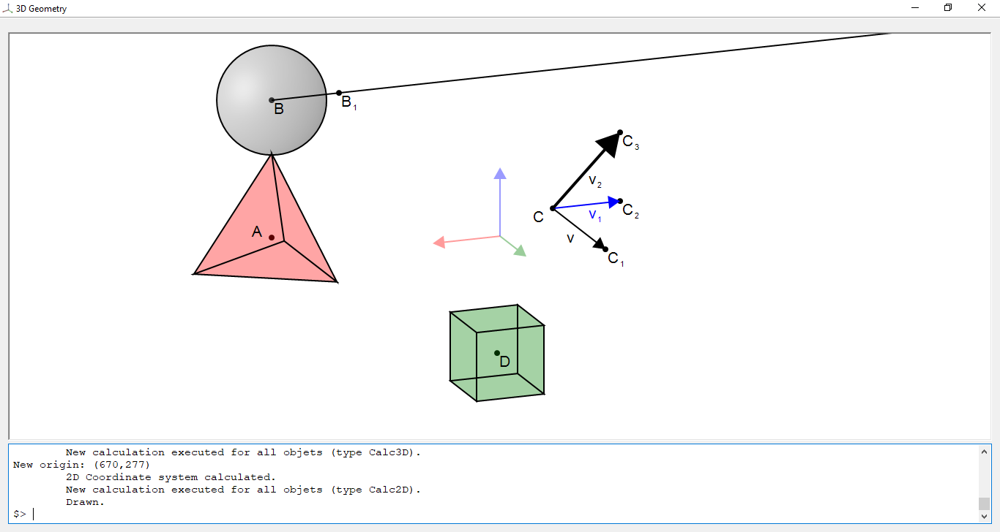
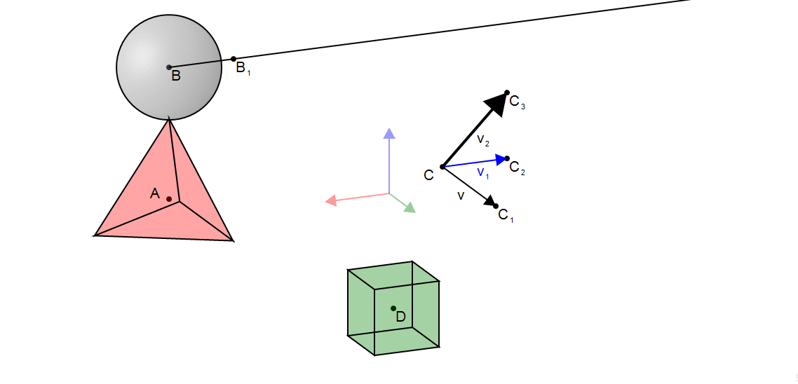
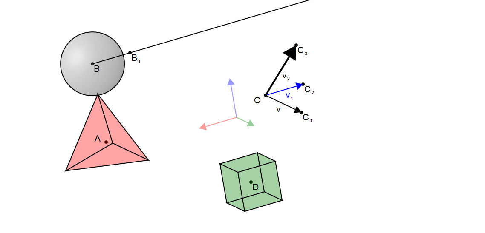
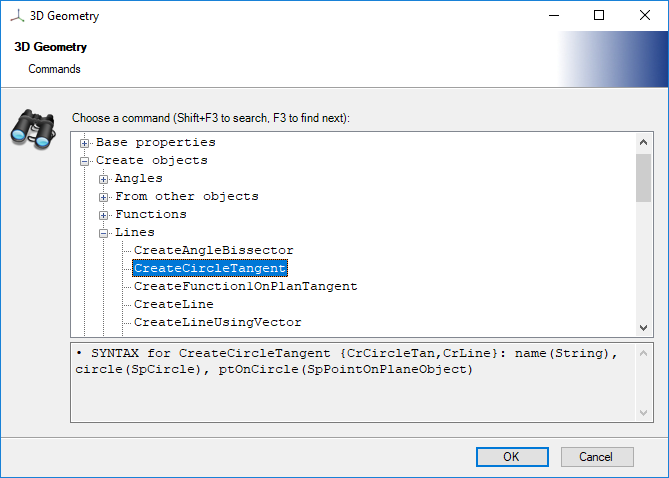
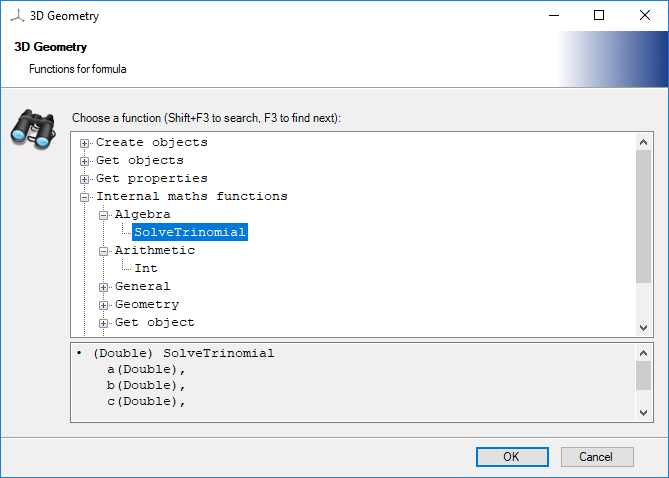
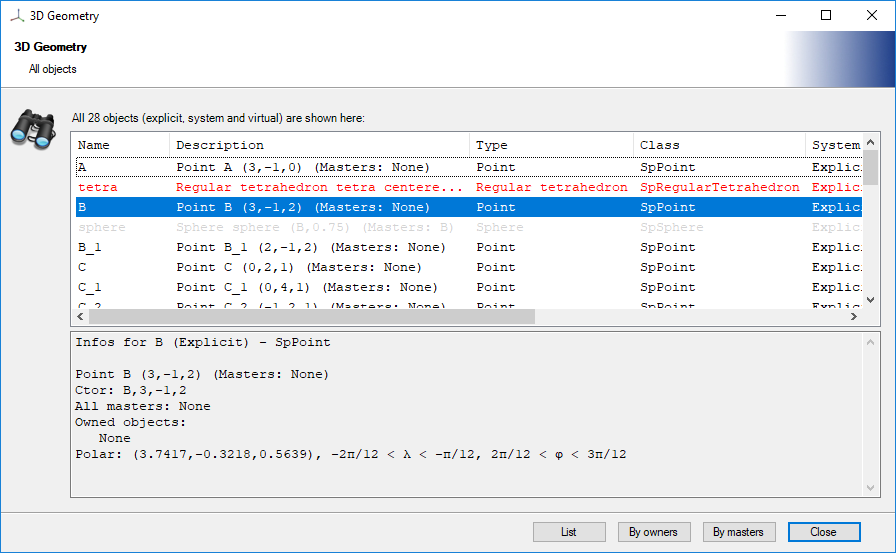
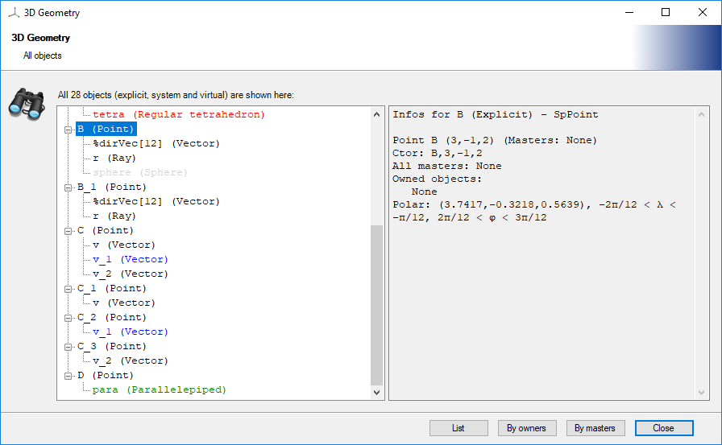
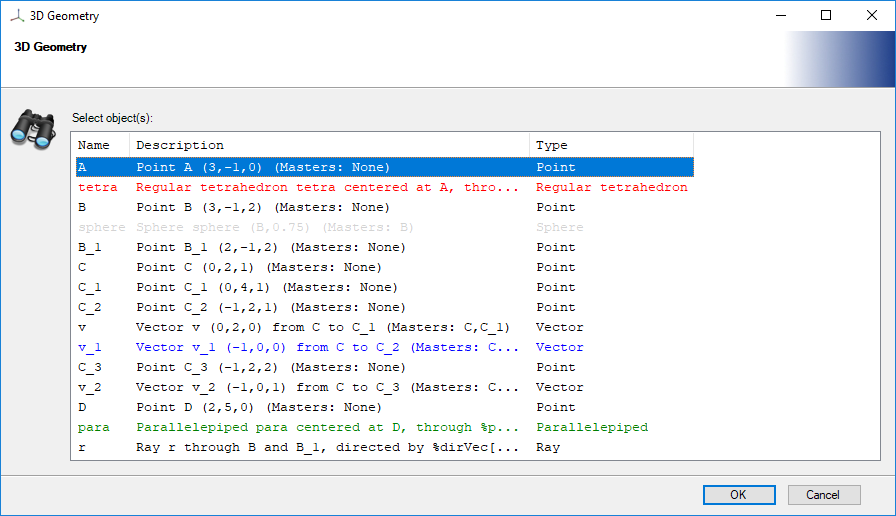

# 3DGeometry: an interactive 3D geometry visualizer


## Introduction

This program was created using C# around 2007-2008, before Geogebra had 3D support.

Here is a screenshot:



You can move the view in any direction. Here are two examples:

<p></p>

<p></p>

You can create:

- 3D objects (lines, vectors, cones, spheres, parallelepipeds, tetrahedrons and other solids),
- planes and 2D objects (lines, vectors, circles, rectangles and other figures),
- functions (on a plane and in space).

Furthermore, you can study intersections between several of these objects, vectors, barycenters, transformations (symmetry, homothety, rotation, translation), angles (bissector, ...), circles (tangent, ...), etc.


## Getting started


Compile the C# source code with Visual Studio, or download the binaries from [my website](http://boberle.com/files/binaries/3dgeometry_binaries.zip).

To create object, you need to enter a command in the command box.  For example, to create a point named `A` at position `(1,2,3)`:

```
CreatePoint A,1,2,3
```

Here are the commands entered to create the previous example:

```
CreatePoint A, 3, -1, 0
CreateRegularTetrahedron tetra, A, 2, 0, 0, 0
ChangeColor Red:50, tetra
CreatePoint B, 3, -1, 2
CreateSphere sphere, B, 0.75
CreatePoint B_1, 2, -1, 2
CreatePoint C, 0, 2, 1
CreatePoint C_1, 0, 4, 1
CreatePoint C_2, -1, 2, 1
CreateVectorUsingPoints v, C, C_1
CreateVectorUsingPoints v_1, C, C_2
ChangeColor Blue, v_1
ChangeWidth 1, v_1
CreatePoint C_3, -1, 2, 2
CreateVectorUsingPoints v_2, C, C_3
ChangeWidth 2, v_2
CreatePoint D, 2, 5, 0
CreateParallelepiped para, D, 1, 1, 1, 0, 0, 0
ChangeColor Green:50, para
CreateRay r, B, B_1
```

See below for the list of all commands.  This list is also available directly in the interface with the `F1` key (use `shift+F1` to get the list of available formulas):

<p></p>

<!--
<p></p>
-->

Use `shift+Enter` after having entered the beginning of the command name for auto-completion.

You can visualize the objects, their details and their dependencances with the `F3` key:

<p></p>

<p></p>

To select objects, use the `F2` key:




You can move the axes by typing `mov` (see the gif animation above):

- use the arrow keys to move the axes horizontally or vertivally,
- use `shift` and the arrow keys to change Euler's angles (phi and theta),
- use `shift` and the `page up` and `down` keys to rotate the view.


The general format of a command is `cmd arg1, arg2, ...`.  Use the double quotes `"` to escape the comma.  Use the `ask` command to get asked for each argument to enter, if you don't remember the exact syntax.

To get help for a specific command, type `cmd ?` (with an interrogation mark).

To open a dialog box for some parameters (for example to set a color or a font, or open or save a file), use `??color`, `??openfile`, `??savefile`, `??font`, `??dir`.

To save the list of commands you have entered, use the `SaveBatch` (and `LoadBatch` to restore) command.

Some other shortcuts:

- `shift+F2`: increase or decrease the command box,
- `F4`: execute the last command,
- `F5`: allow selection in the command box,
- `F10`: clear the current line.


## List of all available commands

Quick access to the main function categories:

- <a href="#1">Create objects</a>: <a href="#2">Space points</a>, <a href="#3">Space objects</a>, <a href="#4">Lines</a>, <a href="#5">Vectors</a>, <a href="#6">Plane points</a>, <a href="#7">Plane objects</a>, <a href="#8">Angles</a>, <a href="#9">Transformations</a>, <a href="#10">Transformed objects</a>, <a href="#11">Functions</a>, <a href="#12">Others</a>, <a href="#13">From other objects</a>,
- <a href="#14">Base properties</a>,
- <a href="#15">Drawing looking</a>,
- <a href="#16">Drawing properties</a>,
- <a href="#17">Files</a>,
- <a href="#18">Formula</a>,
- <a href="#19">Internal commands</a>,
- <a href="#20">Manage objects</a>,
- <a href="#21">Moving modes</a>,
- <a href="#22">Object informations</a>,
- <a href="#23">Objects properties</a>,
- <a href="#24">Selection</a>,
- <a href="#25">System</a>,
- <a href="#26">View properties</a>,
- <a href="#27">Alter objects</a>,
- <a href="#1000">Get objects</a>,
- <a href="#1013">Get properties</a>,
- <a href="#1026">Internal maths functions</a>,
- <a href="#1034">Other functions</a>.


### Create objects<a name="1"/>

#### Space points<a name="2"/>

<table>
<tr><td><b>Command name</b></td><td><b>Parameters</b></td></tr>
<tr><td>CreatePoint<br/><emph>(CrPt)</emph></td><td>name(String), x(DoubleF), y(DoubleF), z(DoubleF)</td></tr>
<tr><td>CreateMidpoint<br/><emph>(CrPt, CrMidpt)</emph></td><td>name(String), spt1(SpPointObject), spt2(SpPointObject)</td></tr>
<tr><td>CreateBarycenter<br/><emph>(CrPt, CrBar)</emph></td><td>name(String), wpoints(WeightedPoint[])[Not Empty]</td></tr>
<tr><td>CreateLinesIntersection<br/><emph>(CrInter, CrLinesInter)</emph></td><td>name(String), line1(SpLine), line2(SpLine)</td></tr>
<tr><td>CreateLineSphereIntersection<br/><emph>(CrInter, CrLineSphInter)</emph></td><td>name(String), line(SpLine), sphere(SpSphere), inter1(Boolean)</td></tr>
<tr><td>CreateOrthoProjPointOnLine<br/><emph>(CrPt, CrLineOrthoProjPt)</emph></td><td>name(String), basePoint(SpPointObject), line(SpLine)</td></tr>
<tr><td>CreatePointOnFunction2<br/><emph>(CrPt, CrFunc2Pt)</emph></td><td>name(String), func(SpFunction2), x(DoubleF), y(DoubleF), isLimited(Boolean)</td></tr>
<tr><td>CreatePointOnLine<br/><emph>(CrPt, CrLinePt)</emph></td><td>name(String), line(SpLine), tParam(DoubleF)</td></tr>
<tr><td>CreatePointOnSphere<br/><emph>(CrPt, CrSphPt)</emph></td><td>name(String), sphere(SpSphere), lambda(DoubleF), phi(DoubleF)</td></tr>
<tr><td>CreateImagePoint<br/><emph>(CrPt, CrImgPt)</emph></td><td>name(String), spt(SpPointObject), vect(SpVectorObject)</td></tr>
<tr><td>CreatePointPolar<br/><emph>(CrPt, CrPolPt)</emph></td><td>name(String), radius(DoubleF), lambda(DoubleF), phi(DoubleF)</td></tr>
<tr><td rowspan="2">CreatePointPolar3UsingCoords<br/><emph>(CrPt, CrPol3Pt, CrPol3PtUsCoords)</emph></td><td>name(String), radius(DoubleF), psi(DoubleF), theta(DoubleF), phi(DoubleF)</td></tr>
<tr><td>name(String), psi(DoubleF), theta(DoubleF), phi(DoubleF), xs(DoubleF), ys(DoubleF), zs(DoubleF)</td></tr>
</table>

#### Space objects<a name="3"/>

<table>
<tr><td><b>Command name</b></td><td><b>Parameters</b></td></tr>
<tr><td>CreateCone<br/><emph>(CrCone, CrSolid)</emph></td><td>name(String), vertex(SpPointObject), baseCircle(SpCircle)</td></tr>
<tr><td>CreateCubeOnPlane<br/><emph>(CrSolid, CrPlaneCube)</emph></td><td>name(String), spt1(SpPointOnPlaneObject), spt2(SpPointOnPlaneObject), invertOnPlane(Boolean), invertInSpace(Boolean)</td></tr>
<tr><td>CreateParallelepiped<br/><emph>(CrCube, CrSolid)</emph></td><td>name(String), center(SpPointObject), length(DoubleF), width(DoubleF), heigth(DoubleF), psi(DoubleF), theta(DoubleF), phi(DoubleF)</td></tr>
<tr><td>CreateRegularTetrahedron<br/><emph>(CrTetra, CrSolid)</emph></td><td>name(String), center(SpPointObject), edgeLength(DoubleF), psi(DoubleF), theta(DoubleF), phi(DoubleF)</td></tr>
<tr><td>CreateRegularTetrahedronOnPlane<br/><emph>(CrSolid, CrPlaneTetra)</emph></td><td>name(String), spt1(SpPointOnPlaneObject), spt2(SpPointOnPlaneObject), invertOnPlane(Boolean), invertInSpace(Boolean)</td></tr>
<tr><td>CreateSolid<br/><emph>(CrSolid)</emph></td><td>name(String), vertices(SpPointObject[])[Not Empty], faces(SpPointObject[][])[Not Empty]</td></tr>
<tr><td>CreateSolidWithCenter<br/><emph>(CrSolid, CrCenteredSolid)</emph></td><td>name(String), center(SpPointObject), vertices(SpPointObject[])[Not Empty], faces(SpPointObject[][])[Not Empty]</td></tr>
<tr><td>CreateSphere<br/><emph>(CrSph)</emph></td><td>name(String), center(SpPointObject), radius(DoubleF)</td></tr>
<tr><td>CreateSphereUsingPoint<br/><emph>(CrSph, CrSphUsPt)</emph></td><td>name(String), center(SpPointObject), point(SpPointObject)</td></tr>
</table>

#### Lines<a name="4"/>

<table>
<tr><td><b>Command name</b></td><td><b>Parameters</b></td></tr>
<tr><td>CreateLine<br/><emph>(CrLine)</emph></td><td>name(String), spt1(SpPointObject), spt2(SpPointObject)</td></tr>
<tr><td>CreateLineUsingVector<br/><emph>(CrLine, CrLineUsVec)</emph></td><td>name(String), spt1(SpPointObject), vec(SpVectorObject)</td></tr>
<tr><td>CreateParallelLine<br/><emph>(CrParLine)</emph></td><td>name(String), spt1(SpPointObject), baseLine(SpLine)</td></tr>
<tr><td>CreatePerpendicularLine<br/><emph>(CrPerLine)</emph></td><td>name(String), spt2(SpPointObject), baseLine(SpLine)</td></tr>
<tr><td>CreatePerpendicularLineToPlane<br/><emph>(CrPerLine, CrPlanePerLine)</emph></td><td>name(String), spt1(SpPointObject), basePlane(SpPlaneObject)</td></tr>
<tr><td>CreateRay<br/><emph>(CrRay)</emph></td><td>name(String), spt1(SpPointObject), spt2(SpPointObject)</td></tr>
<tr><td>CreateSegment<br/><emph>(CrSeg)</emph></td><td>name(String), spt1(SpPointObject), spt2(SpPointObject)</td></tr>
<tr><td>CreatePlanesIntersection<br/><emph>(CrInter, CrPlanesInter)</emph></td><td>name(String), plane1(SpPlaneObject), plane2(SpPlaneObject)</td></tr>
<tr><td>CreateAngleBissector<br/><emph>(CrBiss, CrLine)</emph></td><td>name(String), angle(SpAngle)</td></tr>
<tr><td>CreateCircleTangent<br/><emph>(CrLine, CrCircleTan)</emph></td><td>name(String), circle(SpCircle), ptOnCircle(SpPointOnPlaneObject)</td></tr>
<tr><td>CreateFunction1OnPlanTangent<br/><emph>(CrLine, CrFunc1Tan)</emph></td><td>name(String), function(SpFunction1OnPlane), ptOnFunc(SpPointOnPlaneObject)</td></tr>
<tr><td>CreatePlanePolygonIntersection<br/><emph>(CrInter, CrPlanePolyInter)</emph></td><td>name(String), plane(SpPlaneObject), polygon(SpPolygon)</td></tr>
</table>

#### Vectors<a name="5"/>

<table>
<tr><td><b>Command name</b></td><td><b>Parameters</b></td></tr>
<tr><td>CreateVectorUsingPoints<br/><emph>(CrVec, CrVecUsPts)</emph></td><td>name(String), spt1(SpPointObject), spt2(SpPointObject)</td></tr>
<tr><td>CreateVectorUsingCoords<br/><emph>(CrVec, CrVectUsCoords)</emph></td><td>name(String), spt1(SpPointObject), x(DoubleF), y(DoubleF), z(DoubleF)</td></tr>
<tr><td>CreateSpVectorUsingPointsAndOrigin<br/><emph>(CrVec, CrVecUsPtsAndOrig)</emph></td><td>name(String), spt1(SpPointObject), basePt1(SpPointObject), basePt2(SpPointObject)</td></tr>
<tr><td rowspan="2">CreateVectorUsingPointsAndCoeff<br/><emph>(CrVec, CrVecUsPtsCoeff)</emph></td><td>name(String), coeff(DoubleF), basePt1(SpPointObject), basePt2(SpPointObject)</td></tr>
<tr><td>name(String), spt1(SpPointObject), coeff(DoubleF), basePt1(SpPointObject), basePt2(SpPointObject)</td></tr>
<tr><td>CreateVectorUsingMultiply<br/><emph>(CrVec, CrVecUsMul)</emph></td><td>name(String), spt1(SpPointObject), coeff(DoubleF), vec(SpVectorObject)</td></tr>
<tr><td>CreateVectorUsingSum<br/><emph>(CrVec, CrVecUsSum)</emph></td><td>name(String), spt1(SpPointObject), baseVectors(SpVectorObject[])[Not Empty]</td></tr>
<tr><td>CreateNormalVectorToLine<br/><emph>(CrVec, CrLineNormalVec)</emph></td><td>name(String), spt1(SpPointObject), line(SpLine), planePt(SpPointObject), invertDir(Boolean)</td></tr>
<tr><td>CreateNormalVectorToLineStartingAtLine<br/><emph>(CrVec, CrLineNormalVecAtLine)</emph></td><td>name(String), line(SpLine), spt2(SpPointObject)</td></tr>
<tr><td>CreateNormalVectorToPlane<br/><emph>(CrVec, CrPlaneNormalVec)</emph></td><td>name(String), spt1(SpPointObject), plane(SpPlaneObject), invertDir(Boolean)</td></tr>
<tr><td>CreateNormalVectorToPlaneStartingAtPlane<br/><emph>(CrVec, CrPlaneNormalVecAtPlane)</emph></td><td>name(String), plane(SpPlaneObject), spt2(SpPointObject)</td></tr>
<tr><td>CreateOrthonormalVector<br/><emph>(CrVec, CrOrthoVec)</emph></td><td>name(String), spt1(SpPointObject), baseVec(SpVectorObject), planePt(SpPointObject), invertDir(Boolean)</td></tr>
</table>

#### Plane points<a name="6"/>

<table>
<tr><td><b>Command name</b></td><td><b>Parameters</b></td></tr>
<tr><td>CreatePointOnPlane<br/><emph>(CrPt, CrPlanePt)</emph></td><td>name(String), plane(SpPlaneObject), xp(DoubleF), yp(DoubleF)</td></tr>
<tr><td>CreateOrthoProjPointOnPlane<br/><emph>(CrPlanePt, CrPlaneOrthoProjPt)</emph></td><td>name(String), basePoint(SpPointObject), plane(SpPlaneObject)</td></tr>
<tr><td>CreatePointOnPlaneFromSpace<br/><emph>(CrPt, CrSpPlanePt)</emph></td><td>name(String), plane(SpPlaneObject), basePt(SpPointObject)</td></tr>
<tr><td>CreatePointOnPlanePolar<br/><emph>(CrPt, CrPlanePolPt)</emph></td><td>name(String), plane(SpPlaneObject), radius(DoubleF), theta(DoubleF)</td></tr>
<tr><td>CreatePointOnCircle<br/><emph>(CrPt, CrCirclePt)</emph></td><td>name(String), circle(SpCircle), alpha(DoubleF), isLimited(Boolean)</td></tr>
<tr><td>CreateLineCircleIntersection<br/><emph>(CrInter, CrLineCircleInter)</emph></td><td>name(String), line(SpLine), circle(SpCircle), inter1(Boolean)</td></tr>
<tr><td>CreatePlaneLineIntersection<br/><emph>(CrInter, CrPlaneLineInter)</emph></td><td>name(String), plane(SpPlaneObject), line(SpLine)</td></tr>
<tr><td>CreatePointOnFunction1OnPlane<br/><emph>(CrPt, CrFunc1Pt)</emph></td><td>name(String), func(SpFunction1OnPlane), xp(DoubleF), isLimited(Boolean)</td></tr>
</table>

#### Plane objects<a name="7"/>

<table>
<tr><td><b>Command name</b></td><td><b>Parameters</b></td></tr>
<tr><td>CreatePlane<br/><emph>(CrPlane)</emph></td><td>name(String), origin(SpPointObject), xVec(SpVectorObject), yVec(SpVectorObject)</td></tr>
<tr><td>CreatePlaneUsingPoints<br/><emph>(CrPlane, CrPlaneUsPts)</emph></td><td>name(String), origin(SpPointObject), iPoint(SpPointObject), jPoint(SpPointObject)</td></tr>
<tr><td>CreateParallelPlane<br/><emph>(CrPlane, CrParPlane)</emph></td><td>name(String), origin(SpPointObject), plane(SpPlaneObject)</td></tr>
<tr><td>CreateOrthonormalPlane<br/><emph>(CrPlane, CrOrthoPlane)</emph></td><td>name(String), origin(SpPointObject), xVec(SpVectorObject), planePt(SpPointObject), invertDir(Boolean)</td></tr>
<tr><td>CreateOrthogonalPlaneToLine<br/><emph>(CrPlane, CrLineOrthoPlane)</emph></td><td>name(String), origin(SpPointObject), line(SpLine), alpha(DoubleF)</td></tr>
<tr><td>CreateOrthogonalPlaneToLineUsingPoints<br/><emph>(CrPlane, CrLineOrthoPlaneUsPts)</emph></td><td>name(String), origin(SpPointObject), line(SpLine), planePt(SpPointObject), inverDir(Boolean)</td></tr>
<tr><td>CreateOrthogonalPlaneToPlane<br/><emph>(CrPlane, CrOrthogonalPlane)</emph></td><td>name(String), plane(SpPlaneObject), origin(SpPointObject), planePt(SpPointObject), invertDir(Boolean)</td></tr>
<tr><td>CreateOrthogonalPlaneToVector<br/><emph>(CrPlane, CrVecOrthoPlane)</emph></td><td>name(String), origin(SpPointObject), vector(SpVectorObject), phi(DoubleF)</td></tr>
<tr><td rowspan="2">CreateCircle<br/><emph>(CrCircle)</emph></td><td>name(String), center(SpPointOnPlaneObject), radius(DoubleF)</td></tr>
<tr><td>name(String), center(SpPointOnPlaneObject), radius(DoubleF), min(DoubleF), max(DoubleF)</td></tr>
<tr><td rowspan="2">CreateEllipse<br/><emph>(CrCircle, CrEllipse)</emph></td><td>name(String), center(SpPointOnPlaneObject), width(DoubleF), height(DoubleF)</td></tr>
<tr><td>name(String), center(SpPointOnPlaneObject), width(DoubleF), height(DoubleF), min(DoubleF), max(DoubleF), alpha(DoubleF)</td></tr>
<tr><td rowspan="2">CreateCircleUsingPoint<br/><emph>(CrCircle, CrCircleUsPt)</emph></td><td>name(String), center(SpPointOnPlaneObject), point(SpPointOnPlaneObject)</td></tr>
<tr><td>name(String), center(SpPointOnPlaneObject), point(SpPointOnPlaneObject), min(DoubleF), max(DoubleF)</td></tr>
<tr><td>CreatePlaneSphereIntersection<br/><emph>(CrInter, CrPlaneSphInter)</emph></td><td>name(String), plane(SpPlaneObject), sphere(SpSphere)</td></tr>
<tr><td>CreatePolygon<br/><emph>(CrPoly)</emph></td><td>name(String), vertices(SpPointObject[])[Not Empty]</td></tr>
<tr><td>CreatePolygonOnPlane<br/><emph>(CrPoly, CrPlanePoly)</emph></td><td>name(String), vertices(SpPointOnPlaneObject[])[Not Empty]</td></tr>
<tr><td>CreateRectangle<br/><emph>(CrRect, CrPoly)</emph></td><td>name(String), center(SpPointOnPlaneObject), width(DoubleF), height(DoubleF), alpha(DoubleF)</td></tr>
<tr><td>CreateRegularPolygonOnPlane<br/><emph>(CrPoly, CrRegPoly)</emph></td><td>name(String), center(SpPointOnPlaneObject), spt1(SpPointOnPlaneObject), invertDir(Boolean), ptsNb(Int32)</td></tr>
</table>

#### Angles<a name="8"/>

<table>
<tr><td><b>Command name</b></td><td><b>Parameters</b></td></tr>
<tr><td rowspan="2">CreateAngle<br/><emph>(CrAngle)</emph></td><td>name(String), spt1(SpPointObject), vertex(SpPointObject), spt2(SpPointObject)</td></tr>
<tr><td>name(String), size(Double), isOpposite(Boolean), isOriented(Boolean), spt1(SpPointObject), vertex(SpPointObject), spt2(SpPointObject)</td></tr>
<tr><td>CreateAngleOnPlane<br/><emph>(CrAngle, CrPlaneAngle)</emph></td><td>name(String), size(Double), isOriented(Boolean), spt1(SpPointOnPlaneObject), vertex(SpPointOnPlaneObject), spt2(SpPointOnPlaneObject), onlyPos(Boolean)</td></tr>
<tr><td>CreateFixedAngle<br/><emph>(CrAngle, CrFixAngle)</emph></td><td>name(String), size(Double), isOriented(Boolean), spt1(SpPointObject), vertex(SpPointObject), planePt(SpPointObject), value(DoubleF)</td></tr>
<tr><td>CreateFixedAngleOnPlane<br/><emph>(CrAngle, CrPlaneFixAngle)</emph></td><td>name(String), size(Double), isOriented(Boolean), spt1(SpPointOnPlaneObject), vertex(SpPointOnPlaneObject), value(DoubleF)</td></tr>
</table>

#### Transformations<a name="9"/>

<table>
<tr><td><b>Command name</b></td><td><b>Parameters</b></td></tr>
<tr><td>CreateAxialRotation<br/><emph>(CrTransf, CrAxialRot)</emph></td><td>name(String), lineObj(SpLineObject), alpha(DoubleF)</td></tr>
<tr><td>CreateAxialSymmetry<br/><emph>(CrTransf, CrAxialSym)</emph></td><td>name(String), lineObj(SpLineObject)</td></tr>
<tr><td>CreateHomothety<br/><emph>(CrHomoth, CrTransf)</emph></td><td>name(String), center(SpPointObject), ratio(DoubleF)</td></tr>
<tr><td>CreateRotation<br/><emph>(CrRot, CrTransf)</emph></td><td>name(String), center(SpPointObject), psi(DoubleF), theta(DoubleF), phi(DoubleF)</td></tr>
<tr><td>CreateRotationOfSolid<br/><emph>(CrTransf, CrSolidRot)</emph></td><td>name(String), solid(SpSolid), psi(DoubleF), theta(DoubleF), phi(DoubleF)</td></tr>
<tr><td>CreateRotationOnPlane<br/><emph>(CrTransf, CrPlaneRot)</emph></td><td>name(String), center(SpPointOnPlaneObject), alpha(DoubleF)</td></tr>
<tr><td>CreateTranslation<br/><emph>(CrTransf, CrTranslation)</emph></td><td>name(String), vector(SpVectorObject)</td></tr>
</table>

#### Transformed objects<a name="10"/>

<table>
<tr><td><b>Command name</b></td><td><b>Parameters</b></td></tr>
<tr><td>CreateTrPoint<br/><emph>(CrTrPt, CrTrObj)</emph></td><td>name(String), baseObj(SpPointObject), transformations(SpTransformationObject[])[Not Empty]</td></tr>
<tr><td>CreateTrPointOnPlane<br/><emph>(CrTrObj, CrTrPlanePt)</emph></td><td>name(String), baseObj(SpPointOnPlaneObject), transformations(SpTransformationObject[])[Not Empty]</td></tr>
<tr><td>CreateTrSolid<br/><emph>(CrTrObj, CrTrSolid)</emph></td><td>name(String), baseObj(SpSolid), transformations(SpTransformationObject[])[Not Empty]</td></tr>
</table>

#### Functions<a name="11"/>

<table>
<tr><td><b>Command name</b></td><td><b>Parameters</b></td></tr>
<tr><td>CreateFunction1OnPlane<br/><emph>(CrFunc, CrPlaneFunc1)</emph></td><td>name(String), plane(SpPlaneObject), minX(DoubleF), maxX(DoubleF), res(Double), tension(Single), formula(String)</td></tr>
<tr><td>CreateFunction2<br/><emph>(CrFunc, CrFunc2)</emph></td><td>name(String), minX(DoubleF), maxX(DoubleF), minY(DoubleF), maxY(DoubleF), resX(Double), resY(Double), tension(Single), formula(String)</td></tr>
<tr><td>CreateFunction2OnPlane<br/><emph>(CrFunc, CrPlaneFunc2)</emph></td><td>name(String), plane(SpPlaneObject), minX(DoubleF), maxX(DoubleF), minY(DoubleF), maxY(DoubleF), resX(Double), resY(Double), tension(Single), formula(String)</td></tr>
<tr><td>CreateFunction3<br/><emph>(CrFunc, CrFunc3)</emph></td><td>name(String), minX(DoubleF), maxX(DoubleF), minY(DoubleF), maxY(DoubleF), minZ(DoubleF), maxZ(DoubleF), resX(Double), resY(Double), resZ(Double), tension(Single), formula(String)</td></tr>
</table>

#### Others<a name="12"/>

<table>
<tr><td><b>Command name</b></td><td><b>Parameters</b></td></tr>
<tr><td rowspan="2">CreateCursor<br/><emph>(CrCur)</emph></td><td>name(String), value(DoubleF)</td></tr>
<tr><td>name(String), value(DoubleF), min(DoubleF), max(DoubleF)</td></tr>
<tr><td>CreateText<br/><emph>(CrText)</emph></td><td>name(String), absolute(Boolean), text(String[])[Not Empty]</td></tr>
</table>

#### From other objects<a name="13"/>

<table>
<tr><td><b>Command name</b></td><td><b>Parameters</b></td></tr>
<tr><td>CopyPoint<br/><emph>(copyPt)</emph></td><td>arg0(String), arg1(SpPoint)</td></tr>
<tr><td>CreatePolygonsFromSolid<br/><emph>(crSolidPolys)</emph></td><td>solid(SpSolid), polysName(String)</td></tr>
<tr><td>CreateSegmentsFromPolygon<br/><emph>(crPolySegs)</emph></td><td>poly(SpPolygon), segsName(String)</td></tr>
<tr><td>CreateSegmentsFromSolid<br/><emph>(crSolidSegs)</emph></td><td>solid(SpSolid), segsName(String)</td></tr>
<tr><td>CreateSystemPoints<br/><emph>(crSysPts)</emph></td><td>arg0(Boolean)</td></tr>
</table>

### Base properties<a name="14"/>

<table>
<tr><td><b>Command name</b></td><td><b>Parameters</b></td></tr>
<tr><td>ChangeClipRect</td><td>arg0(Int32), arg1(Int32), arg2(Int32), arg3(Int32)</td></tr>
<tr><td>XNorm</td><td>arg0(Single)</td></tr>
<tr><td>YNorm</td><td>arg0(Single)</td></tr>
<tr><td>ZNorm</td><td>arg0(Single)</td></tr>
</table>

### Drawing looking<a name="15"/>

<table>
<tr><td><b>Command name</b></td><td><b>Parameters</b></td></tr>
<tr><td>AxisWidth<br/><emph>(AWidth)</emph></td><td>arg0(Single)</td></tr>
<tr><td>CoordinateSystemWidth<br/><emph>(CSWidth)</emph></td><td>arg0(Single)</td></tr>
<tr><td>DraftScale</td><td>arg0(Single)</td></tr>
<tr><td>GraduationsFont</td><td>arg0(Font)</td></tr>
<tr><td>GridWidth<br/><emph>(GWidth)</emph></td><td>arg0(Single)</td></tr>
<tr><td>Phi</td><td>arg0(Double)</td></tr>
<tr><td>Rotation</td><td>arg0(Double)</td></tr>
<tr><td>Scale</td><td>arg0(Single)</td></tr>
<tr><td>ShowAxes</td><td>arg0(Int32)</td></tr>
<tr><td>ShowClipRect<br/><emph>(ShClip)</emph></td><td>arg0(Boolean)</td></tr>
<tr><td>ShowCoordSystem</td><td>arg0(Boolean)</td></tr>
<tr><td>ShowGraduations</td><td>arg0(Boolean)</td></tr>
<tr><td>ShowXYGrid</td><td>arg0(Boolean)</td></tr>
<tr><td>ShowXZGrid</td><td>arg0(Boolean)</td></tr>
<tr><td>ShowYZGrid</td><td>arg0(Boolean)</td></tr>
<tr><td>Theta</td><td>arg0(Double)</td></tr>
<tr><td>XAxisColor<br/><emph>(XColor)</emph></td><td>arg0(Color)</td></tr>
<tr><td>YAxisColor<br/><emph>(YColor)</emph></td><td>arg0(Color)</td></tr>
<tr><td>ZAxisColor<br/><emph>(ZColor)</emph></td><td>arg0(Color)</td></tr>
<tr><td>Zoom</td><td>arg0(Int32)</td></tr>
</table>

### Drawing properties<a name="16"/>

<table>
<tr><td><b>Command name</b></td><td><b>Parameters</b></td></tr>
<tr><td>AutoDraw</td><td>arg0(Boolean)</td></tr>
<tr><td rowspan="2">DisplayOrder</td><td>(No param)</td></tr>
<tr><td>arg0(SpObject[])[Not Empty]</td></tr>
<tr><td>Draw</td><td>(No param)</td></tr>
<tr><td>DrawHighQuality</td><td>arg0(Boolean)</td></tr>
<tr><td>RecalculateAll</td><td>(No param)</td></tr>
<tr><td>ShowInfos<br/><emph>(SI)</emph></td><td>(No param)</td></tr>
</table>

### Files<a name="17"/>

<table>
<tr><td><b>Command name</b></td><td><b>Parameters</b></td></tr>
<tr><td>CopyDrawing<br/><emph>(Copy)</emph></td><td>(No param)</td></tr>
<tr><td>ExportToPng<br/><emph>(Export)</emph></td><td>arg0(String)</td></tr>
<tr><td>Load</td><td>filename(String)</td></tr>
<tr><td rowspan="2">Message<br/><emph>(Msg)</emph></td><td>arg0(String)</td></tr>
<tr><td>(No param)</td></tr>
<tr><td>Save</td><td>(No param)</td></tr>
<tr><td>SaveAs</td><td>filename(String)</td></tr>
</table>

### Formula<a name="18"/>

<table>
<tr><td><b>Command name</b></td><td><b>Parameters</b></td></tr>
<tr><td rowspan="2">?FormulaFunctions</td><td>arg0(String)</td></tr>
<tr><td>excludeOverloads(Boolean), text(String)</td></tr>
<tr><td>Calc</td><td>arg0(String)</td></tr>
<tr><td>MakeFormulaMan</td><td>arg0(Int32), arg1(String)</td></tr>
</table>

### Internal commands<a name="19"/>

<table>
<tr><td><b>Command name</b></td><td><b>Parameters</b></td></tr>
<tr><td rowspan="2">?</td><td>(No param)</td></tr>
<tr><td>arg0(String[])[Not Empty]</td></tr>
<tr><td>Ask</td><td>cmdName(String)</td></tr>
<tr><td>ChangeConsoleBackColor</td><td>arg0(Color)</td></tr>
<tr><td>ChangeConsoleColor</td><td>arg0(Color)</td></tr>
<tr><td>ChangeConsoleFont</td><td>arg0(Font)</td></tr>
<tr><td>Cls</td><td>(No param)</td></tr>
<tr><td>GetCD</td><td>(No param)</td></tr>
<tr><td>LoadBatch</td><td>arg0(String)</td></tr>
<tr><td rowspan="2">MakeMan</td><td>what(Int32), filename(String), showInConsole(Boolean)</td></tr>
<tr><td>what(Int32), filename(String), showInConsole(Boolean), excludePattern(String)</td></tr>
<tr><td>Pause</td><td>(No param)</td></tr>
<tr><td>SaveBatch</td><td>arg0(String)</td></tr>
<tr><td>SetCD</td><td>arg0(String)</td></tr>
<tr><td>ShowPreviousError</td><td>(No param)</td></tr>
</table>

### Manage objects<a name="20"/>

<table>
<tr><td><b>Command name</b></td><td><b>Parameters</b></td></tr>
<tr><td>Delete<br/><emph>(Del)</emph></td><td>arg0(SpObject[])[Not Empty]</td></tr>
<tr><td>DeleteSelected<br/><emph>(DelSel)</emph></td><td>(No param)</td></tr>
<tr><td rowspan="2">Extract</td><td>objectToExtract(SpObject), newName(String)</td></tr>
<tr><td>owner(SpObject), nameOrProp(String), newName(String)</td></tr>
<tr><td>ExtractFromParallelepiped<br/><emph>(Extract)</emph></td><td>objectToExtract(SpParallelepiped), newName(String[])[Not Empty]</td></tr>
<tr><td>ExtractFromPolygon<br/><emph>(Extract)</emph></td><td>objectToExtract(SpPolygon), newNames(String[])[Not Empty]</td></tr>
<tr><td>ExtractFromTetrahedron<br/><emph>(Extract)</emph></td><td>objectToExtract(SpRegularTetrahedron), newName(String[])[Not Empty]</td></tr>
<tr><td>Replace</td><td>oldObject(SpObject), newObject(SpObject)</td></tr>
</table>

### Moving modes<a name="21"/>

<table>
<tr><td><b>Command name</b></td><td><b>Parameters</b></td></tr>
<tr><td>Moving<br/><emph>(Mov)</emph></td><td>(No param)</td></tr>
<tr><td>MovingClipRect<br/><emph>(MovClip)</emph></td><td>(No param)</td></tr>
<tr><td>MovingCursor<br/><emph>(MovCur)</emph></td><td>arg0(SpCursor)</td></tr>
<tr><td>MovingLabel<br/><emph>(MovLbl)</emph></td><td>arg0(SpObject)</td></tr>
<tr><td>MovingLabelParam<br/><emph>(MovLblP)</emph></td><td>arg0(SpObject)</td></tr>
<tr><td>MovingPoint<br/><emph>(MovPt)</emph></td><td>arg0(SpPointObject)</td></tr>
<tr><td>MovingScale<br/><emph>(MovScale)</emph></td><td>(No param)</td></tr>
</table>

### Object informations<a name="22"/>

<table>
<tr><td><b>Command name</b></td><td><b>Parameters</b></td></tr>
<tr><td>RecalculateObj<br/><emph>(Recalc)</emph></td><td>arg0(Boolean), arg1(SpObject[])[Not Empty]</td></tr>
<tr><td>ShowAllObjects<br/><emph>(all)</emph></td><td>(No param)</td></tr>
<tr><td rowspan="2">ShowFunctionArray<br/><emph>(ShFuncArr)</emph></td><td>min(SpFunction1OnPlane), max(Decimal), resolution(Decimal), arg3(Decimal)</td></tr>
<tr><td>minX(SpFunction2), maxX(Decimal), resolutionX(Decimal), minY(Decimal), maxY(Decimal), resolutionY(Decimal), arg6(Decimal)</td></tr>
<tr><td>ShowInfos<br/><emph>(SI)</emph></td><td>arg0(SpObject[])[Not Empty]</td></tr>
</table>

### Objects properties<a name="23"/>

<table>
<tr><td><b>Command name</b></td><td><b>Parameters</b></td></tr>
<tr><td>ChangeBackColor<br/><emph>(BCol)</emph></td><td>arg0(Color), arg1(SpObject[])[Empty]</td></tr>
<tr><td rowspan="2">ChangeBmpSphere<br/><emph>(ChBmpSph)</emph></td><td>arg0(SpSphere)</td></tr>
<tr><td>name(SpSphere), convertToGray(Boolean), light(Decimal), alpha(Byte), red(Decimal), green(Decimal), blue(Decimal)</td></tr>
<tr><td>ChangeBrushStyle<br/><emph>(BStyle)</emph></td><td>arg0(BrushStyle), arg1(SpObject[])[Empty]</td></tr>
<tr><td>ChangeColor<br/><emph>(Col)</emph></td><td>arg0(Color), arg1(SpObject[])[Empty]</td></tr>
<tr><td>ChangeDashStyle<br/><emph>(DStyle)</emph></td><td>arg0(DashStyle), arg1(SpObject[])[Empty]</td></tr>
<tr><td>ChangeEdgeColor<br/><emph>(ECol)</emph></td><td>arg0(Color), arg1(SpObject[])[Empty]</td></tr>
<tr><td>ChangeHatchColor<br/><emph>(HCol)</emph></td><td>arg0(Color), arg1(SpObject[])[Empty]</td></tr>
<tr><td>ChangeHatchStyle<br/><emph>(HStyle)</emph></td><td>arg0(HatchStyle), arg1(SpObject[])[Empty]</td></tr>
<tr><td>ChangeLabelCoords<br/><emph>(LblCoords)</emph></td><td>arg0(SpObject), arg1(Int32), arg2(Int32)</td></tr>
<tr><td>ChangeLabelFont<br/><emph>(LblFont)</emph></td><td>arg0(Font), arg1(SpObject[])[Empty]</td></tr>
<tr><td>ChangeLabelParam<br/><emph>(LblP)</emph></td><td>arg0(SpObject), arg1(Double)</td></tr>
<tr><td>ChangePointShape<br/><emph>(PtShape)</emph></td><td>arg0(PointShape), arg1(SpObject[])[Empty]</td></tr>
<tr><td rowspan="2">ChangeProperties<br/><emph>(Props)</emph></td><td>(No param)</td></tr>
<tr><td>arg0(Boolean)</td></tr>
<tr><td>ChangeWidth<br/><emph>(Widh)</emph></td><td>arg0(Single), arg1(SpObject[])[Empty]</td></tr>
<tr><td>Hide</td><td>arg0(Boolean), arg1(SpObject[])[Empty]</td></tr>
<tr><td>Rename<br/><emph>(Ren)</emph></td><td>arg0(SpObject), arg1(String)</td></tr>
<tr><td>ShowName<br/><emph>(ShName)</emph></td><td>arg0(Boolean), arg1(SpObject[])[Empty]</td></tr>
<tr><td>ShowUndefinedObjects<br/><emph>(ShUndef)</emph></td><td>(No param)</td></tr>
<tr><td>UseBmpSphere<br/><emph>(UseBmpSph)</emph></td><td>arg0(SpSphere), arg1(Boolean)</td></tr>
</table>

### Selection<a name="24"/>

<table>
<tr><td><b>Command name</b></td><td><b>Parameters</b></td></tr>
<tr><td>AppendToSelection<br/><emph>(App)</emph></td><td>arg0(SpObject[])[Not Empty]</td></tr>
<tr><td>Deselect<br/><emph>(Des)</emph></td><td>arg0(SpObject[])[Not Empty]</td></tr>
<tr><td>DeselectAll<br/><emph>(DesAll)</emph></td><td>(No param)</td></tr>
<tr><td>Select<br/><emph>(Sel)</emph></td><td>arg0(SpObject[])[Not Empty]</td></tr>
<tr><td>SelectAll<br/><emph>(SelAll)</emph></td><td>(No param)</td></tr>
<tr><td>SelectedList<br/><emph>(SelList)</emph></td><td>(No param)</td></tr>
</table>

### System<a name="25"/>

<table>
<tr><td><b>Command name</b></td><td><b>Parameters</b></td></tr>
<tr><td>Cancel</td><td>(No param)</td></tr>
<tr><td>ChangeDecimalPlaces</td><td>arg0(Byte)</td></tr>
<tr><td rowspan="2">ChangeIncrements<br/><emph>(chIncr)</emph></td><td>(No param)</td></tr>
<tr><td>SystemCoordsBig(Int32), SystemCoordsLittle(Int32), ScaleBig(Double), ScaleLittle(Double), LabelBig(Int32), LabelLittle(Int32), LblParamBig(Int32), LblParamLittle(Int32), ClipRectBig(Double), ClipRectLittle(Double), PointBig(Int32), PointLittle(Int32), AngleBig(Double), AngleLittle(Double), arg14(Double), arg15(Double)</td></tr>
<tr><td>DisplayTypes</td><td>arg0(Int32)</td></tr>
<tr><td>EnlargeText<br/><emph>(Big)</emph></td><td>(No param)</td></tr>
<tr><td>Exit<br/><emph>(Quit)</emph></td><td>(No param)</td></tr>
<tr><td>GC</td><td>(No param)</td></tr>
<tr><td>New</td><td>(No param)</td></tr>
<tr><td>Restore</td><td>(No param)</td></tr>
<tr><td>SaveInHistory<br/><emph>(SaveHist)</emph></td><td>(No param)</td></tr>
<tr><td>ShowCalculationResult<br/><emph>(ShCalcRes)</emph></td><td>arg0(Boolean)</td></tr>
<tr><td>ShowDrawingMessages<br/><emph>(ShDrawMsg)</emph></td><td>arg0(Boolean)</td></tr>
<tr><td>ShowInfos</td><td>arg0(Boolean)</td></tr>
<tr><td>SuspendCalculation</td><td>arg0(Boolean)</td></tr>
</table>

### View properties<a name="26"/>

<table>
<tr><td><b>Command name</b></td><td><b>Parameters</b></td></tr>
<tr><td>CenterOrigin</td><td>(No param)</td></tr>
<tr><td rowspan="3">ChangeView<br/><emph>(View)</emph></td><td>arg0(SpPlaneObject)</td></tr>
<tr><td>arg0(ViewType)</td></tr>
<tr><td>arg0(SpPointObject), arg1(SpPointObject), arg2(SpPointObject)</td></tr>
<tr><td>OriginOnWindow</td><td>arg0(Int32), arg1(Int32)</td></tr>
<tr><td>TranslateOrigin</td><td>arg0(Int32), arg1(Int32) </td></tr>
</table>

### Alter objects<a name="27"/>

<table>
<tr><td><b>Command name</b></td><td><b>Parameters</b></td></tr>
<tr><td>Alter<br/><emph>(alt)</emph></td><td>arg0(SpObject)</td></tr>
</table>

#### Space points<a name="28"/>

<table>
<tr><td><b>Command name</b></td><td><b>Parameters</b></td></tr>
<tr><td>AlterPoint<br/><emph>(AltPt)</emph></td><td>objName(String), x(DoubleF), y(DoubleF), z(DoubleF)</td></tr>
<tr><td>AlterMidpoint<br/><emph>(AltPt, AltMidpt)</emph></td><td>objName(String), spt1(SpPointObject), spt2(SpPointObject)</td></tr>
<tr><td>AlterBarycenter<br/><emph>(AltPt, AltBar)</emph></td><td>objName(String), wpoints(WeightedPoint[])[Not Empty]</td></tr>
<tr><td>AlterLinesIntersection<br/><emph>(AltInter, AltLinesInter)</emph></td><td>objName(String), line1(SpLine), line2(SpLine)</td></tr>
<tr><td>AlterLineSphereIntersection<br/><emph>(AltInter, AltLineSphInter)</emph></td><td>objName(String), line(SpLine), sphere(SpSphere), inter1(Boolean)</td></tr>
<tr><td>AlterOrthoProjPointOnLine<br/><emph>(AltPt, AltLineOrthoProjPt)</emph></td><td>objName(String), basePoint(SpPointObject), line(SpLine)</td></tr>
<tr><td>AlterPointOnFunction2<br/><emph>(AltPt, AltFunc2Pt)</emph></td><td>objName(String), func(SpFunction2), x(DoubleF), y(DoubleF), isLimited(Boolean)</td></tr>
<tr><td>AlterPointOnLine<br/><emph>(AltPt, AltLinePt)</emph></td><td>objName(String), line(SpLine), tParam(DoubleF)</td></tr>
<tr><td>AlterPointOnSphere<br/><emph>(AltPt, AltSphPt)</emph></td><td>objName(String), sphere(SpSphere), lambda(DoubleF), phi(DoubleF)</td></tr>
<tr><td>AlterPointPolar<br/><emph>(AltPt, AltPolPt)</emph></td><td>objName(String), radius(DoubleF), lambda(DoubleF), phi(DoubleF)</td></tr>
<tr><td rowspan="2">AlterPointPolar3UsingCoords<br/><emph>(AltPt, AltPol3Pt, AltPol3PtUsCoords)</emph></td><td>objName(String), radius(DoubleF), psi(DoubleF), theta(DoubleF), phi(DoubleF)</td></tr>
<tr><td>objName(String), psi(DoubleF), theta(DoubleF), phi(DoubleF), xs(DoubleF), ys(DoubleF), zs(DoubleF)</td></tr>
<tr><td>AlterImagePoint<br/><emph>(AltPt, AltImgPt)</emph></td><td>objName(String), spt(SpPointObject), vect(SpVectorObject)</td></tr>
</table>

#### Space objects<a name="29"/>

<table>
<tr><td><b>Command name</b></td><td><b>Parameters</b></td></tr>
<tr><td>AlterCone<br/><emph>(AltCone, AltSolid)</emph></td><td>objName(String), vertex(SpPointObject), baseCircle(SpCircle)</td></tr>
<tr><td>AlterCubeOnPlane<br/><emph>(AltSolid, AltPlaneCube)</emph></td><td>objName(String), spt1(SpPointOnPlaneObject), spt2(SpPointOnPlaneObject), invertOnPlane(Boolean), invertInSpace(Boolean)</td></tr>
<tr><td>AlterParallelepiped<br/><emph>(AltCube, AltSolid)</emph></td><td>objName(String), center(SpPointObject), length(DoubleF), width(DoubleF), heigth(DoubleF), psi(DoubleF), theta(DoubleF), phi(DoubleF)</td></tr>
<tr><td>AlterRegularTetrahedron<br/><emph>(AltTetra, AltSolid)</emph></td><td>objName(String), center(SpPointObject), edgeLength(DoubleF), psi(DoubleF), theta(DoubleF), phi(DoubleF)</td></tr>
<tr><td>AlterRegularTetrahedronOnPlane<br/><emph>(AltSolid, AltPlaneTetra)</emph></td><td>objName(String), spt1(SpPointOnPlaneObject), spt2(SpPointOnPlaneObject), invertOnPlane(Boolean), invertInSpace(Boolean)</td></tr>
<tr><td>AlterSolid<br/><emph>(AltSolid)</emph></td><td>objName(String), vertices(SpPointObject[])[Not Empty], faces(SpPointObject[][])[Not Empty]</td></tr>
<tr><td>AlterSolidWithCenter<br/><emph>(AltSolid, AltCenteredSolid)</emph></td><td>objName(String), center(SpPointObject), vertices(SpPointObject[])[Not Empty], faces(SpPointObject[][])[Not Empty]</td></tr>
<tr><td>AlterSphere<br/><emph>(AltSph)</emph></td><td>objName(String), center(SpPointObject), radius(DoubleF)</td></tr>
<tr><td>AlterSphereUsingPoint<br/><emph>(AltSph, AltSphUsPt)</emph></td><td>objName(String), center(SpPointObject), point(SpPointObject)</td></tr>
</table>

#### Lines<a name="30"/>

<table>
<tr><td><b>Command name</b></td><td><b>Parameters</b></td></tr>
<tr><td>AlterLine<br/><emph>(AltLine)</emph></td><td>objName(String), spt1(SpPointObject), spt2(SpPointObject)</td></tr>
<tr><td>AlterLineUsingVector<br/><emph>(AltLine, AltLineUsVec)</emph></td><td>objName(String), spt1(SpPointObject), vec(SpVectorObject)</td></tr>
<tr><td>AlterParallelLine<br/><emph>(AltParLine)</emph></td><td>objName(String), spt1(SpPointObject), baseLine(SpLine)</td></tr>
<tr><td>AlterPerpendicularLine<br/><emph>(AltPerLine)</emph></td><td>objName(String), spt2(SpPointObject), baseLine(SpLine)</td></tr>
<tr><td>AlterPerpendicularLineToPlane<br/><emph>(AltPerLine, AltPlanePerLine)</emph></td><td>objName(String), spt1(SpPointObject), basePlane(SpPlaneObject)</td></tr>
<tr><td>AlterRay<br/><emph>(AltRay)</emph></td><td>objName(String), spt1(SpPointObject), spt2(SpPointObject)</td></tr>
<tr><td>AlterSegment<br/><emph>(AltSeg)</emph></td><td>objName(String), spt1(SpPointObject), spt2(SpPointObject)</td></tr>
<tr><td>AlterPlanesIntersection<br/><emph>(AltInter, AltPlanesInter)</emph></td><td>objName(String), plane1(SpPlaneObject), plane2(SpPlaneObject)</td></tr>
<tr><td>AlterAngleBissector<br/><emph>(AltBiss, AltLine)</emph></td><td>objName(String), angle(SpAngle)</td></tr>
<tr><td>AlterCircleTangent<br/><emph>(AltLine, AltCircleTan)</emph></td><td>objName(String), circle(SpCircle), ptOnCircle(SpPointOnPlaneObject)</td></tr>
<tr><td>AlterFunction1OnPlanTangent<br/><emph>(AltLine, AltFunc1Tan)</emph></td><td>objName(String), function(SpFunction1OnPlane), ptOnFunc(SpPointOnPlaneObject)</td></tr>
<tr><td>AlterPlanePolygonIntersection<br/><emph>(AltInter, AltPlanePolyInter)</emph></td><td>objName(String), plane(SpPlaneObject), polygon(SpPolygon)</td></tr>
</table>

#### Vectors<a name="31"/>

<table>
<tr><td><b>Command name</b></td><td><b>Parameters</b></td></tr>
<tr><td>AlterVectorUsingPoints<br/><emph>(AltVec, AltVecUsPts)</emph></td><td>objName(String), spt1(SpPointObject), spt2(SpPointObject)</td></tr>
<tr><td>AlterVectorUsingCoords<br/><emph>(AltVec, AltVectUsCoords)</emph></td><td>objName(String), spt1(SpPointObject), x(DoubleF), y(DoubleF), z(DoubleF)</td></tr>
<tr><td>AlterSpVectorUsingPointsAndOrigin<br/><emph>(AltVec, AltVecUsPtsAndOrig)</emph></td><td>objName(String), spt1(SpPointObject), basePt1(SpPointObject), basePt2(SpPointObject)</td></tr>
<tr><td rowspan="2">AlterVectorUsingPointsAndCoeff<br/><emph>(AltVec, AltVecUsPtsCoeff)</emph></td><td>objName(String), coeff(DoubleF), basePt1(SpPointObject), basePt2(SpPointObject)</td></tr>
<tr><td>objName(String), spt1(SpPointObject), coeff(DoubleF), basePt1(SpPointObject), basePt2(SpPointObject)</td></tr>
<tr><td>AlterVectorUsingMultiply<br/><emph>(AltVec, AltVecUsMul)</emph></td><td>objName(String), spt1(SpPointObject), coeff(DoubleF), vec(SpVectorObject)</td></tr>
<tr><td>AlterVectorUsingSum<br/><emph>(AltVec, AltVecUsSum)</emph></td><td>objName(String), spt1(SpPointObject), baseVectors(SpVectorObject[])[Not Empty]</td></tr>
<tr><td>AlterNormalVectorToLine<br/><emph>(AltVec, AltLineNormalVec)</emph></td><td>objName(String), spt1(SpPointObject), line(SpLine), planePt(SpPointObject), invertDir(Boolean)</td></tr>
<tr><td>AlterNormalVectorToLineStartingAtLine<br/><emph>(AltVec, AltLineNormalVecAtLine)</emph></td><td>objName(String), line(SpLine), spt2(SpPointObject)</td></tr>
<tr><td>AlterNormalVectorToPlane<br/><emph>(AltVec, AltPlaneNormalVec)</emph></td><td>objName(String), spt1(SpPointObject), plane(SpPlaneObject), invertDir(Boolean)</td></tr>
<tr><td>AlterNormalVectorToPlaneStartingAtPlane<br/><emph>(AltVec, AltPlaneNormalVecAtPlane)</emph></td><td>objName(String), plane(SpPlaneObject), spt2(SpPointObject)</td></tr>
<tr><td>AlterOrthonormalVector<br/><emph>(AltVec, AltOrthoVec)</emph></td><td>objName(String), spt1(SpPointObject), baseVec(SpVectorObject), planePt(SpPointObject), invertDir(Boolean)</td></tr>
</table>

#### Plane points<a name="32"/>

<table>
<tr><td><b>Command name</b></td><td><b>Parameters</b></td></tr>
<tr><td>AlterPointOnPlane<br/><emph>(AltPt, AltPlanePt)</emph></td><td>objName(String), plane(SpPlaneObject), xp(DoubleF), yp(DoubleF)</td></tr>
<tr><td>AlterPointOnPlaneFromSpace<br/><emph>(AltPt, AltSpPlanePt)</emph></td><td>objName(String), plane(SpPlaneObject), basePt(SpPointObject)</td></tr>
<tr><td>AlterPointOnPlanePolar<br/><emph>(AltPt, AltPlanePolPt)</emph></td><td>objName(String), plane(SpPlaneObject), radius(DoubleF), theta(DoubleF)</td></tr>
<tr><td>AlterLineCircleIntersection<br/><emph>(AltInter, AltLineCircleInter)</emph></td><td>objName(String), line(SpLine), circle(SpCircle), inter1(Boolean)</td></tr>
<tr><td>AlterOrthoProjPointOnPlane<br/><emph>(AltPlanePt, AltPlaneOrthoProjPt)</emph></td><td>objName(String), basePoint(SpPointObject), plane(SpPlaneObject)</td></tr>
<tr><td>AlterPlaneLineIntersection<br/><emph>(AltInter, AltPlaneLineInter)</emph></td><td>objName(String), plane(SpPlaneObject), line(SpLine)</td></tr>
<tr><td>AlterPointOnCircle<br/><emph>(AltPt, AltCirclePt)</emph></td><td>objName(String), circle(SpCircle), alpha(DoubleF), isLimited(Boolean)</td></tr>
<tr><td>AlterPointOnFunction1OnPlane<br/><emph>(AltPt, AltFunc1Pt)</emph></td><td>objName(String), func(SpFunction1OnPlane), xp(DoubleF), isLimited(Boolean)</td></tr>
</table>

#### Plane objects<a name="33"/>

<table>
<tr><td><b>Command name</b></td><td><b>Parameters</b></td></tr>
<tr><td>AlterPlane<br/><emph>(AltPlane)</emph></td><td>objName(String), origin(SpPointObject), xVec(SpVectorObject), yVec(SpVectorObject)</td></tr>
<tr><td>AlterPlaneUsingPoints<br/><emph>(AltPlane, AltPlaneUsPts)</emph></td><td>objName(String), origin(SpPointObject), iPoint(SpPointObject), jPoint(SpPointObject)</td></tr>
<tr><td>AlterParallelPlane<br/><emph>(AltPlane, AltParPlane)</emph></td><td>objName(String), origin(SpPointObject), plane(SpPlaneObject)</td></tr>
<tr><td>AlterOrthonormalPlane<br/><emph>(AltPlane, AltOrthoPlane)</emph></td><td>objName(String), origin(SpPointObject), xVec(SpVectorObject), planePt(SpPointObject), invertDir(Boolean)</td></tr>
<tr><td>AlterOrthogonalPlaneToLine<br/><emph>(AltPlane, AltLineOrthoPlane)</emph></td><td>objName(String), origin(SpPointObject), line(SpLine), alpha(DoubleF)</td></tr>
<tr><td>AlterOrthogonalPlaneToLineUsingPoints<br/><emph>(AltPlane, AltLineOrthoPlaneUsPts)</emph></td><td>objName(String), origin(SpPointObject), line(SpLine), planePt(SpPointObject), invertDir(Boolean)</td></tr>
<tr><td>AlterOrthogonalPlaneToPlane<br/><emph>(AltPlane, AltOrthogonalPlane)</emph></td><td>objName(String), plane(SpPlaneObject), origin(SpPointObject), planePt(SpPointObject), invertDir(Boolean)</td></tr>
<tr><td>AlterOrthogonalPlaneToVector<br/><emph>(AltPlane, AltVecOrthoPlane)</emph></td><td>objName(String), origin(SpPointObject), vector(SpVectorObject), phi(DoubleF)</td></tr>
<tr><td rowspan="2">AlterCircle<br/><emph>(AltCircle)</emph></td><td>objName(String), center(SpPointOnPlaneObject), radius(DoubleF)</td></tr>
<tr><td>objName(String), center(SpPointOnPlaneObject), radius(DoubleF), min(DoubleF), max(DoubleF)</td></tr>
<tr><td rowspan="2">AlterCircleUsingPoint<br/><emph>(AltCircle, AltCircleUsPt)</emph></td><td>objName(String), center(SpPointOnPlaneObject), point(SpPointOnPlaneObject)</td></tr>
<tr><td>objName(String), center(SpPointOnPlaneObject), point(SpPointOnPlaneObject), min(DoubleF), max(DoubleF)</td></tr>
<tr><td rowspan="2">AlterEllipse<br/><emph>(AltCircle, AltEllipse)</emph></td><td>objName(String), center(SpPointOnPlaneObject), width(DoubleF), height(DoubleF)</td></tr>
<tr><td>objName(String), center(SpPointOnPlaneObject), width(DoubleF), height(DoubleF), min(DoubleF), max(DoubleF), alpha(DoubleF)</td></tr>
<tr><td>AlterPlaneSphereIntersection<br/><emph>(AltInter, AltPlaneSphInter)</emph></td><td>objName(String), plane(SpPlaneObject), sphere(SpSphere)</td></tr>
<tr><td>AlterPolygon<br/><emph>(AltPoly)</emph></td><td>objName(String), vertices(SpPointObject[])[Not Empty]</td></tr>
<tr><td>AlterPolygonOnPlane<br/><emph>(AltPoly, AltPlanePoly)</emph></td><td>objName(String), vertices(SpPointOnPlaneObject[])[Not Empty]</td></tr>
<tr><td>AlterRectangle<br/><emph>(AltRect, AltPoly)</emph></td><td>objName(String), center(SpPointOnPlaneObject), width(DoubleF), height(DoubleF), alpha(DoubleF)</td></tr>
<tr><td>AlterRegularPolygonOnPlane<br/><emph>(AltPoly, AltRegPoly)</emph></td><td>objName(String), center(SpPointOnPlaneObject), spt1(SpPointOnPlaneObject), invertDir(Boolean)</td></tr>
</table>

#### Angles<a name="34"/>

<table>
<tr><td><b>Command name</b></td><td><b>Parameters</b></td></tr>
<tr><td rowspan="2">AlterAngle<br/><emph>(AltAngle)</emph></td><td>objName(String), spt1(SpPointObject), vertex(SpPointObject), spt2(SpPointObject)</td></tr>
<tr><td>objName(String), size(Double), isOpposite(Boolean), isOriented(Boolean), spt1(SpPointObject), vertex(SpPointObject), spt2(SpPointObject)</td></tr>
<tr><td>AlterAngleOnPlane<br/><emph>(AltAngle, AltPlaneAngle)</emph></td><td>objName(String), size(Double), isOriented(Boolean), spt1(SpPointOnPlaneObject), vertex(SpPointOnPlaneObject), spt2(SpPointOnPlaneObject), onlyPos(Boolean)</td></tr>
<tr><td>AlterFixedAngle<br/><emph>(AltAngle, AltFixAngle)</emph></td><td>objName(String), size(Double), isOriented(Boolean), spt1(SpPointObject), vertex(SpPointObject), planePt(SpPointObject), value(DoubleF)</td></tr>
<tr><td>AlterFixedAngleOnPlane<br/><emph>(AltAngle, AltPlaneFixAngle)</emph></td><td>objName(String), size(Double), isOriented(Boolean), spt1(SpPointOnPlaneObject), vertex(SpPointOnPlaneObject), value(DoubleF)</td></tr>
</table>

#### Transformations<a name="35"/>

<table>
<tr><td><b>Command name</b></td><td><b>Parameters</b></td></tr>
<tr><td>AlterAxialRotation<br/><emph>(AltTransf, AltAxialRot)</emph></td><td>objName(String), lineObj(SpLineObject), alpha(DoubleF)</td></tr>
<tr><td>AlterAxialSymmetry<br/><emph>(AltTransf, AltAxialSym)</emph></td><td>objName(String), lineObj(SpLineObject)</td></tr>
<tr><td>AlterHomothety<br/><emph>(AltHomoth, AltTransf)</emph></td><td>objName(String), center(SpPointObject), ratio(DoubleF)</td></tr>
<tr><td>AlterRotation<br/><emph>(AltRot, AltTransf)</emph></td><td>objName(String), center(SpPointObject), psi(DoubleF), theta(DoubleF), phi(DoubleF)</td></tr>
<tr><td>AlterRotationOfSolid<br/><emph>(AltTransf, AltSolidRot)</emph></td><td>objName(String), solid(SpSolid), psi(DoubleF), theta(DoubleF), phi(DoubleF)</td></tr>
<tr><td>AlterRotationOnPlane<br/><emph>(AltTransf, AltPlaneRot)</emph></td><td>objName(String), center(SpPointOnPlaneObject), alpha(DoubleF)</td></tr>
<tr><td>AlterTranslation<br/><emph>(AltTransf, AltTranslation)</emph></td><td>objName(String), vector(SpVectorObject)</td></tr>
</table>

#### Transformed objects<a name="36"/>

<table>
<tr><td><b>Command name</b></td><td><b>Parameters</b></td></tr>
<tr><td>AlterTrPoint<br/><emph>(AltTrPt, AltTrObj)</emph></td><td>objName(String), baseObj(SpPointObject), transformations(SpTransformationObject[])[Not Empty]</td></tr>
<tr><td>AlterTrPointOnPlane<br/><emph>(AltTrObj, AltTrPlanePt)</emph></td><td>objName(String), baseObj(SpPointOnPlaneObject), transformations(SpTransformationObject[])[Not Empty]</td></tr>
<tr><td>AlterTrSolid<br/><emph>(AltTrObj, AltTrSolid)</emph></td><td>objName(String), baseObj(SpSolid), transformations(SpTransformationObject[])[Not Empty]</td></tr>
</table>

#### Functions<a name="37"/>

<table>
<tr><td><b>Command name</b></td><td><b>Parameters</b></td></tr>
<tr><td>AlterFunction1OnPlane<br/><emph>(AltFunc, AltPlaneFunc1)</emph></td><td>objName(String), plane(SpPlaneObject), minX(DoubleF), maxX(DoubleF), resX(Double), tension(Single), formula(String)</td></tr>
<tr><td>AlterFunction2<br/><emph>(AltFunc, AltFunc2)</emph></td><td>objName(String), minX(DoubleF), maxX(DoubleF), minY(DoubleF), maxY(DoubleF), resX(Double), resY(Double), tension(Single), formula(String)</td></tr>
<tr><td>AlterFunction2OnPlane<br/><emph>(AltFunc, AltPlaneFunc2)</emph></td><td>objName(String), plane(SpPlaneObject), minX(DoubleF), maxX(DoubleF), minY(DoubleF), maxY(DoubleF), resX(Double), resY(Double), tension(Single), formula(String)</td></tr>
<tr><td>AlterFunction3<br/><emph>(AltFunc, AltFunc3)</emph></td><td>objName(String), minX(DoubleF), maxX(DoubleF), minY(DoubleF), maxY(DoubleF), minZ(DoubleF), maxZ(DoubleF), resX(Double), resY(Double), resZ(Double), tension(Single), formula(String)</td></tr>
</table>

#### Others<a name="38"/>

<table>
<tr><td><b>Command name</b></td><td><b>Parameters</b></td></tr>
<tr><td rowspan="2">AlterCursor<br/><emph>(AltCur)</emph></td><td>objName(String), value(DoubleF)</td></tr>
<tr><td>objName(String), value(DoubleF), min(DoubleF), max(DoubleF)</td></tr>
<tr><td>AlterText<br/><emph>(AltText)</emph></td><td>objName(String), absolute(Boolean), text(String[])[Not Empty]</td></tr>
</table>


### Get objects<a name="1000"/>

#### Space points<a name="1001"/>

<table>
<tr><td><b>Command name</b></td><td><b>Parameters</b></td></tr>
<tr><td>GetBar</td><td>name(String)</td></tr>
<tr><td>GetFunc2Pt</td><td>name(String)</td></tr>
<tr><td>GetImgPt</td><td>name(String)</td></tr>
<tr><td>GetLineOrthoProjPt</td><td>name(String)</td></tr>
<tr><td>GetLinePt</td><td>name(String)</td></tr>
<tr><td>GetLinesInter</td><td>name(String)</td></tr>
<tr><td>GetLineSphInter</td><td>name(String)</td></tr>
<tr><td>GetMidpt</td><td>name(String)</td></tr>
<tr><td>GetPol3Pt</td><td>name(String)</td></tr>
<tr><td>GetPol3PtUsCoords</td><td>name(String)</td></tr>
<tr><td>GetPolPt</td><td>name(String)</td></tr>
<tr><td>GetPt</td><td>name(String)</td></tr>
<tr><td>GetPtObj</td><td>name(String)</td></tr>
<tr><td>GetSphPt</td><td>name(String)</td></tr>
</table>

#### Space objects<a name="1002"/>

<table>
<tr><td><b>Command name</b></td><td><b>Parameters</b></td></tr>
<tr><td>GetCenteredSolid</td><td>name(String)</td></tr>
<tr><td>GetCone</td><td>name(String)</td></tr>
<tr><td>GetCube</td><td>name(String)</td></tr>
<tr><td>GetPlaneCube</td><td>name(String)</td></tr>
<tr><td>GetPlaneTetra</td><td>name(String)</td></tr>
<tr><td>GetSolid</td><td>name(String)</td></tr>
<tr><td>GetSph</td><td>name(String)</td></tr>
<tr><td>GetSphUsPt</td><td>name(String)</td></tr>
<tr><td>GetTetra</td><td>name(String)</td></tr>
</table>

#### Lines<a name="1003"/>

<table>
<tr><td><b>Command name</b></td><td><b>Parameters</b></td></tr>
<tr><td>GetBiss</td><td>name(String)</td></tr>
<tr><td>GetCircleTan</td><td>name(String)</td></tr>
<tr><td>GetFunc1Tan</td><td>name(String)</td></tr>
<tr><td>GetLine</td><td>name(String)</td></tr>
<tr><td>GetLineObj</td><td>name(String)</td></tr>
<tr><td>GetLineUsVec</td><td>name(String)</td></tr>
<tr><td>GetParLine</td><td>name(String)</td></tr>
<tr><td>GetPerLine</td><td>name(String)</td></tr>
<tr><td>GetPlanePerLine</td><td>name(String)</td></tr>
<tr><td>GetPlanePolyInter</td><td>name(String)</td></tr>
<tr><td>GetPlanesInter</td><td>name(String)</td></tr>
<tr><td>GetRay</td><td>name(String)</td></tr>
<tr><td>GetSeg</td><td>name(String)</td></tr>
</table>

#### Vectors<a name="1004"/>

<table>
<tr><td><b>Command name</b></td><td><b>Parameters</b></td></tr>
<tr><td>GetLineNormalVec</td><td>name(String)</td></tr>
<tr><td>GetLineNormalVecAtLine</td><td>name(String)</td></tr>
<tr><td>GetOrthoVec</td><td>name(String)</td></tr>
<tr><td>GetPlaneNormalVec</td><td>name(String)</td></tr>
<tr><td>GetPlaneNormalVecAtPlane</td><td>name(String)</td></tr>
<tr><td>GetVecObj</td><td>name(String)</td></tr>
<tr><td>GetVectUsCoords</td><td>name(String)</td></tr>
<tr><td>GetVecUsMul</td><td>name(String)</td></tr>
<tr><td>GetVecUsPts</td><td>name(String)</td></tr>
<tr><td>GetVecUsPtsAndOrig</td><td>name(String)</td></tr>
<tr><td>GetVecUsPtsCoeff</td><td>name(String)</td></tr>
<tr><td>GetVecUsSum</td><td>name(String)</td></tr>
</table>

#### Plane points<a name="1005"/>

<table>
<tr><td><b>Command name</b></td><td><b>Parameters</b></td></tr>
<tr><td>GetCirclePt</td><td>name(String)</td></tr>
<tr><td>GetFunc1Pt</td><td>name(String)</td></tr>
<tr><td>GetLineCircleInter</td><td>name(String)</td></tr>
<tr><td>GetPlaneLineInter</td><td>name(String)</td></tr>
<tr><td>GetPlaneOrthoProjPt</td><td>name(String)</td></tr>
<tr><td>GetPlanePolPt</td><td>name(String)</td></tr>
<tr><td>GetPlanePt</td><td>name(String)</td></tr>
<tr><td>GetPlanePtObj</td><td>name(String)</td></tr>
<tr><td>GetSpPlanePt</td><td>name(String)</td></tr>
</table>

#### Plane objects<a name="1006"/>

<table>
<tr><td><b>Command name</b></td><td><b>Parameters</b></td></tr>
<tr><td>GetCircle</td><td>name(String)</td></tr>
<tr><td>GetCircleUsPt</td><td>name(String)</td></tr>
<tr><td>GetEllipse</td><td>name(String)</td></tr>
<tr><td>GetLineOrthoPlane</td><td>name(String)</td></tr>
<tr><td>GetLineOrthoPlaneUsPts</td><td>name(String)</td></tr>
<tr><td>GetOrthogonalPlane</td><td>name(String)</td></tr>
<tr><td>GetOrthoPlane</td><td>name(String)</td></tr>
<tr><td>GetParPlane</td><td>name(String)</td></tr>
<tr><td>GetPlane</td><td>name(String)</td></tr>
<tr><td>GetPlaneObj</td><td>name(String)</td></tr>
<tr><td>GetPlanePoly</td><td>name(String)</td></tr>
<tr><td>GetPlaneSphInter</td><td>name(String)</td></tr>
<tr><td>GetPlaneUsPts</td><td>name(String)</td></tr>
<tr><td>GetPoly</td><td>name(String)</td></tr>
<tr><td>GetRect</td><td>name(String)</td></tr>
<tr><td>GetRegPoly</td><td>name(String)</td></tr>
<tr><td>GetVecOrthoPlane</td><td>name(String)</td></tr>
</table>

#### Angles<a name="1007"/>

<table>
<tr><td><b>Command name</b></td><td><b>Parameters</b></td></tr>
<tr><td>GetAngle</td><td>name(String)</td></tr>
<tr><td>GetFixAngle</td><td>name(String)</td></tr>
<tr><td>GetPlaneAngle</td><td>name(String)</td></tr>
<tr><td>GetPlaneFixAngle</td><td>name(String)</td></tr>
</table>

#### Transformations<a name="1008"/>

<table>
<tr><td><b>Command name</b></td><td><b>Parameters</b></td></tr>
<tr><td>GetAxialRot</td><td>name(String)</td></tr>
<tr><td>GetAxialSym</td><td>name(String)</td></tr>
<tr><td>GetHomoth</td><td>name(String)</td></tr>
<tr><td>GetPlaneRot</td><td>name(String)</td></tr>
<tr><td>GetRot</td><td>name(String)</td></tr>
<tr><td>GetSolidRot</td><td>name(String)</td></tr>
<tr><td>GetTransf</td><td>name(String)</td></tr>
<tr><td>GetTranslation</td><td>name(String)</td></tr>
</table>

#### Transformed objects<a name="1009"/>

<table>
<tr><td><b>Command name</b></td><td><b>Parameters</b></td></tr>
<tr><td>GetTrPlanePt</td><td>name(String)</td></tr>
<tr><td>GetTrPt</td><td>name(String)</td></tr>
<tr><td>GetTrSolid</td><td>name(String)</td></tr>
</table>

#### Functions<a name="1010"/>

<table>
<tr><td><b>Command name</b></td><td><b>Parameters</b></td></tr>
<tr><td>GetFunc2</td><td>name(String)</td></tr>
<tr><td>GetFunc3</td><td>name(String)</td></tr>
<tr><td>GetFuncObj</td><td>name(String)</td></tr>
<tr><td>GetPlaneFunc1</td><td>name(String)</td></tr>
<tr><td>GetPlaneFunc2</td><td>name(String)</td></tr>
</table>

#### Object<a name="1011"/>

<table>
<tr><td><b>Command name</b></td><td><b>Parameters</b></td></tr>
<tr><td>GetObj</td><td>name(String)</td></tr>
</table>

#### Others<a name="1012"/>

<table>
<tr><td><b>Command name</b></td><td><b>Parameters</b></td></tr>
<tr><td>GetCur</td><td>name(String)</td></tr>
<tr><td>GetText</td><td>name(String)</td></tr>
</table>

### Get properties<a name="1013"/>

#### Angles<a name="1014"/>

<table>
<tr><td><b>Command name</b></td><td><b>Parameters</b></td></tr>
<tr><td>Angle_Point1</td><td>obj(SpAngle)</td></tr>
<tr><td>Angle_Point2</td><td>obj(SpAngle)</td></tr>
<tr><td>Angle_PointForBissector</td><td>obj(SpAngle)</td></tr>
<tr><td>Angle_RadValue</td><td>obj(SpAngle)</td></tr>
<tr><td>Angle_Vertex</td><td>obj(SpAngle)</td></tr>
<tr><td>FixAngle_PlanePoint</td><td>obj(SpFixedAngle)</td></tr>
<tr><td>PlaneAngle_Plane</td><td>obj(SpAngleOnPlane)</td></tr>
</table>

#### Functions<a name="1015"/>

<table>
<tr><td><b>Command name</b></td><td><b>Parameters</b></td></tr>
<tr><td>FuncObj_MaxX</td><td>obj(SpFunctionObject)</td></tr>
<tr><td>FuncObj_MaxY</td><td>obj(SpFunctionObject)</td></tr>
<tr><td>FuncObj_MaxZ</td><td>obj(SpFunctionObject)</td></tr>
<tr><td>FuncObj_MinX</td><td>obj(SpFunctionObject)</td></tr>
<tr><td>FuncObj_MinY</td><td>obj(SpFunctionObject)</td></tr>
<tr><td>FuncObj_MinZ</td><td>obj(SpFunctionObject)</td></tr>
<tr><td>PlaneFunc1_Plane</td><td>obj(SpFunction1OnPlane)</td></tr>
<tr><td>PlaneFunc2_Plane</td><td>obj(SpFunction2OnPlane)</td></tr>
<tr><td>GetPropObj</td><td>obj(SpObject), propName(String)</td></tr>
</table>

#### Lines<a name="1016"/>

<table>
<tr><td><b>Command name</b></td><td><b>Parameters</b></td></tr>
<tr><td>Biss_Angle</td><td>obj(SpAngleBissector)</td></tr>
<tr><td>CircleTan_Circle</td><td>obj(SpCircleTangent)</td></tr>
<tr><td>Func1Tan_Function</td><td>obj(SpFunction1OnPlaneTangent)</td></tr>
<tr><td rowspan="2">Length</td><td>obj(SpSegment)</td></tr>
<tr><td>name(String)</td></tr>
<tr><td>Line_Vector</td><td>obj(SpLine)</td></tr>
<tr><td>LineObj_Point1</td><td>obj(SpLineObject)</td></tr>
<tr><td>LineObj_Point2</td><td>obj(SpLineObject)</td></tr>
<tr><td>LineUsVec_BaseVector</td><td>obj(SpLineUsingVector)</td></tr>
<tr><td>ParLine_BaseLine</td><td>obj(SpParallelLine)</td></tr>
<tr><td>PerLine_BaseLine</td><td>obj(SpPerpendicularLine)</td></tr>
<tr><td>PlanePerLine_Plane</td><td>obj(SpPerpendicularLineToPlane)</td></tr>
<tr><td>PlanePolyInter_Plane</td><td>obj(SpPlanePolygonIntersection)</td></tr>
<tr><td>PlanePolyInter_Polygon</td><td>obj(SpPlanePolygonIntersection)</td></tr>
<tr><td>PlanesInter_Plane1</td><td>obj(SpPlanesIntersection)</td></tr>
<tr><td>PlanesInter_Plane2</td><td>obj(SpPlanesIntersection)</td></tr>
<tr><td>Seg_Length</td><td>obj(SpSegment)</td></tr>
</table>

#### Others<a name="1017"/>

<table>
<tr><td><b>Command name</b></td><td><b>Parameters</b></td></tr>
<tr><td rowspan="2">Cur</td><td>obj(SpCursor)</td></tr>
<tr><td>name(String)</td></tr>
<tr><td>Cur_Value</td><td>obj(SpCursor)</td></tr>
<tr><td>Text_Text</td><td>obj(SpText)</td></tr>
</table>

#### Owned objects<a name="1018"/>

<table>
<tr><td><b>Command name</b></td><td><b>Parameters</b></td></tr>
<tr><td rowspan="3">GetOwnedObj</td><td>ownerName(String), ownedIndex(Int32)</td></tr>
<tr><td>ownerName(String), ownedName(String)</td></tr>
<tr><td>owner(SpObject), ownedName(String)</td></tr>
</table>

#### Plane objects<a name="1019"/>

<table>
<tr><td><b>Command name</b></td><td><b>Parameters</b></td></tr>
<tr><td>Circle_Center</td><td>obj(SpCircle)</td></tr>
<tr><td>Circle_Max</td><td>obj(SpCircle)</td></tr>
<tr><td>Circle_Min</td><td>obj(SpCircle)</td></tr>
<tr><td>Circle_Plane</td><td>obj(SpCircle)</td></tr>
<tr><td>Circle_Radius</td><td>obj(SpCircle)</td></tr>
<tr><td>CircleUsPt_Point</td><td>obj(SpCircleUsingPoint)</td></tr>
<tr><td>Ellipse_Alpha</td><td>obj(SpEllipse)</td></tr>
<tr><td>Ellipse_EllipseHeight</td><td>obj(SpEllipse)</td></tr>
<tr><td>Ellipse_EllipseWidth</td><td>obj(SpEllipse)</td></tr>
<tr><td>LineOrthoPlane_Line</td><td>obj(SpOrthogonalPlaneToLine)</td></tr>
<tr><td>LineOrthoPlaneUsPts_Line</td><td>obj(SpOrthogonalPlaneToLineUsingPoints)</td></tr>
<tr><td>LineOrthoPlaneUsPts_PlanePoint</td><td>obj(SpOrthogonalPlaneToLineUsingPoints)</td></tr>
<tr><td>OrthogonalPlane_BasePlane</td><td>obj(SpOrthogonalPlaneToPlane)</td></tr>
<tr><td>OrthogonalPlane_PlanePoint</td><td>obj(SpOrthogonalPlaneToPlane)</td></tr>
<tr><td>OrthoPlane_BaseXVector</td><td>obj(SpOrthonormalPlane)</td></tr>
<tr><td>OrthoPlane_PlanePoint</td><td>obj(SpOrthonormalPlane)</td></tr>
<tr><td>ParPlane_BasePlane</td><td>obj(SpParallelPlane)</td></tr>
<tr><td>Plane_BaseXVector</td><td>obj(SpPlane)</td></tr>
<tr><td>Plane_BaseYVector</td><td>obj(SpPlane)</td></tr>
<tr><td>PlaneObj_NormalVectorCoords</td><td>obj(SpPlaneObject)</td></tr>
<tr><td>PlaneObj_Origin</td><td>obj(SpPlaneObject)</td></tr>
<tr><td>PlaneObj_XVector</td><td>obj(SpPlaneObject)</td></tr>
<tr><td>PlaneObj_YVector</td><td>obj(SpPlaneObject)</td></tr>
<tr><td>PlanePoly_Plane</td><td>obj(SpPolygonOnPlane)</td></tr>
<tr><td>PlaneSphInter_Sphere</td><td>obj(SpPlaneSphereIntersection)</td></tr>
<tr><td>PlaneUsPts_BaseIPoint</td><td>obj(SpPlaneUsingPoints)</td></tr>
<tr><td>PlaneUsPts_BaseJPoint</td><td>obj(SpPlaneUsingPoints)</td></tr>
<tr><td>Poly_Area</td><td>obj(SpPolygon)</td></tr>
<tr><td>Poly_Perimeter</td><td>obj(SpPolygon)</td></tr>
<tr><td>Radius</td><td>obj(SpCircle)</td></tr>
<tr><td>Rect_Alpha</td><td>obj(SpRectangleOnPlane)</td></tr>
<tr><td>Rect_Center</td><td>obj(SpRectangleOnPlane)</td></tr>
<tr><td>Rect_Height</td><td>obj(SpRectangleOnPlane)</td></tr>
<tr><td>Rect_Width</td><td>obj(SpRectangleOnPlane)</td></tr>
<tr><td>RegPoly_Center</td><td>obj(SpRegularPolygonOnPlane)</td></tr>
<tr><td>RegPoly_Point1</td><td>obj(SpRegularPolygonOnPlane)</td></tr>
<tr><td>RegPoly_PointsNumber</td><td>obj(SpRegularPolygonOnPlane)</td></tr>
<tr><td>VecOrthoPlane_Alpha</td><td>obj(SpOrthogonalPlaneToVector)</td></tr>
<tr><td>VecOrthoPlane_Vector</td><td>obj(SpOrthogonalPlaneToVector)</td></tr>
</table>

#### Plane points<a name="1020"/>

<table>
<tr><td><b>Command name</b></td><td><b>Parameters</b></td></tr>
<tr><td>CirclePt_Alpha</td><td>obj(SpPointOnCircle)</td></tr>
<tr><td>CirclePt_Circle</td><td>obj(SpPointOnCircle)</td></tr>
<tr><td>Func1Pt_Function</td><td>obj(SpPointOnFunction1OnPlane)</td></tr>
<tr><td>LineCircleInter_Circle</td><td>obj(SpLineCircleIntersection)</td></tr>
<tr><td>LineCircleInter_Line</td><td>obj(SpLineCircleIntersection)</td></tr>
<tr><td>PlaneLineInter_Line</td><td>obj(SpPlaneLineIntersection)</td></tr>
<tr><td>PlaneOrthoProjPt_BasePoint</td><td>obj(SpOrthoProjPointOnPlane)</td></tr>
<tr><td>PlanePolPt_Radius</td><td>obj(SpPointOnPlanePolar)</td></tr>
<tr><td>PlanePolPt_Theta</td><td>obj(SpPointOnPlanePolar)</td></tr>
<tr><td>PlanePtObj_CoordinatesOnPlane</td><td>obj(SpPointOnPlaneObject)</td></tr>
<tr><td>PlanePtObj_Plane</td><td>obj(SpPointOnPlaneObject)</td></tr>
<tr><td>PlanePtObj_XOnPlane</td><td>obj(SpPointOnPlaneObject)</td></tr>
<tr><td>PlanePtObj_YOnPlane</td><td>obj(SpPointOnPlaneObject)</td></tr>
<tr><td>SpPlanePt_BasePoint</td><td>obj(SpPointOnPlaneFromSpace)</td></tr>
<tr><td>Radius</td><td>name(String)</td></tr>
</table>

#### Space objects<a name="1021"/>

<table>
<tr><td><b>Command name</b></td><td><b>Parameters</b></td></tr>
<tr><td>Cone_BaseCircle</td><td>obj(SpCone)</td></tr>
<tr><td>Cone_Vertex</td><td>obj(SpCone)</td></tr>
<tr><td>Cube_Height</td><td>obj(SpParallelepiped)</td></tr>
<tr><td>Cube_Length</td><td>obj(SpParallelepiped)</td></tr>
<tr><td>Cube_Width</td><td>obj(SpParallelepiped)</td></tr>
<tr><td>PlaneCube_Plane</td><td>obj(SpCubeOnPlane)</td></tr>
<tr><td>PlaneCube_Point1</td><td>obj(SpCubeOnPlane)</td></tr>
<tr><td>PlaneCube_Point2</td><td>obj(SpCubeOnPlane)</td></tr>
<tr><td>PlaneTetra_Plane</td><td>obj(SpRegularTetrahedronOnPlane)</td></tr>
<tr><td>PlaneTetra_Point1</td><td>obj(SpRegularTetrahedronOnPlane)</td></tr>
<tr><td>PlaneTetra_Point2</td><td>obj(SpRegularTetrahedronOnPlane)</td></tr>
<tr><td>Radius</td><td>obj(SpSphere)</td></tr>
<tr><td>Solid_Center</td><td>obj(SpSolid)</td></tr>
<tr><td>Sph_Center</td><td>obj(SpSphere)</td></tr>
<tr><td>Sph_Radius</td><td>obj(SpSphere)</td></tr>
<tr><td>SphUsPt_Point</td><td>obj(SpSphereUsingPoint)</td></tr>
<tr><td>Tetra_EdgeLength</td><td>obj(SpRegularTetrahedron)</td></tr>
</table>

#### Space points<a name="1022"/>

<table>
<tr><td><b>Command name</b></td><td><b>Parameters</b></td></tr>
<tr><td>Bar_Mass</td><td>obj(SpBarycenter)</td></tr>
<tr><td>Func2Pt_Function</td><td>obj(SpPointOnFunction2)</td></tr>
<tr><td>ImgPt_BasePoint</td><td>obj(SpImagePoint)</td></tr>
<tr><td>ImgPt_Vector</td><td>obj(SpImagePoint)</td></tr>
<tr><td>LineOrthoProjPt_BasePoint</td><td>obj(SpOrthoProjPointOnLine)</td></tr>
<tr><td>LineOrthoProjPt_Line</td><td>obj(SpOrthoProjPointOnLine)</td></tr>
<tr><td>LinePt_BaseLine</td><td>obj(SpPointOnLine)</td></tr>
<tr><td>LinePt_TParam</td><td>obj(SpPointOnLine)</td></tr>
<tr><td>LinesInter_Line1</td><td>obj(SpLinesIntersection)</td></tr>
<tr><td>LinesInter_Line2</td><td>obj(SpLinesIntersection)</td></tr>
<tr><td>LineSphInter_Line</td><td>obj(SpLineSphereIntersection)</td></tr>
<tr><td>LineSphInter_Sphere</td><td>obj(SpLineSphereIntersection)</td></tr>
<tr><td>Midpt_Point1</td><td>obj(SpMidpoint)</td></tr>
<tr><td>Midpt_Point2</td><td>obj(SpMidpoint)</td></tr>
<tr><td>Pol3Pt_Phi</td><td>obj(SpPointPolar3)</td></tr>
<tr><td>Pol3Pt_Psi</td><td>obj(SpPointPolar3)</td></tr>
<tr><td>Pol3Pt_Radius</td><td>obj(SpPointPolar3)</td></tr>
<tr><td>Pol3Pt_Theta</td><td>obj(SpPointPolar3)</td></tr>
<tr><td>Pol3PtUsCoords_Phi</td><td>obj(SpPointPolar3UsingCoords)</td></tr>
<tr><td>Pol3PtUsCoords_Psi</td><td>obj(SpPointPolar3UsingCoords)</td></tr>
<tr><td>Pol3PtUsCoords_Theta</td><td>obj(SpPointPolar3UsingCoords)</td></tr>
<tr><td>Pol3PtUsCoords_XStart</td><td>obj(SpPointPolar3UsingCoords)</td></tr>
<tr><td>Pol3PtUsCoords_YStart</td><td>obj(SpPointPolar3UsingCoords)</td></tr>
<tr><td>Pol3PtUsCoords_ZStart</td><td>obj(SpPointPolar3UsingCoords)</td></tr>
<tr><td>PolPt_Lambda</td><td>obj(SpPointPolar)</td></tr>
<tr><td>PolPt_Phi</td><td>obj(SpPointPolar)</td></tr>
<tr><td>PolPt_Radius</td><td>obj(SpPointPolar)</td></tr>
<tr><td>PtObj_Coordinates</td><td>obj(SpPointObject)</td></tr>
<tr><td>PtObj_X</td><td>obj(SpPointObject)</td></tr>
<tr><td>PtObj_Y</td><td>obj(SpPointObject)</td></tr>
<tr><td>PtObj_Z</td><td>obj(SpPointObject)</td></tr>
<tr><td>SphPt_Lambda</td><td>obj(SpPointOnSphere)</td></tr>
<tr><td>SphPt_Phi</td><td>obj(SpPointOnSphere)</td></tr>
<tr><td>SphPt_Sphere</td><td>obj(SpPointOnSphere)</td></tr>
<tr><td>X</td><td>obj(SpPointObject)</td></tr>
<tr><td>Y</td><td>obj(SpPointObject)</td></tr>
<tr><td>Z</td><td>obj(SpPointObject)</td></tr>
</table>

#### Transformations<a name="1023"/>

<table>
<tr><td><b>Command name</b></td><td><b>Parameters</b></td></tr>
<tr><td>AxialRot_Alpha</td><td>obj(SpAxialRotation)</td></tr>
<tr><td>AxialRot_BaseLineObject</td><td>obj(SpAxialRotation)</td></tr>
<tr><td>AxialRot_Vector</td><td>obj(SpAxialRotation)</td></tr>
<tr><td>AxialSym_BaseLineObject</td><td>obj(SpAxialSymmetry)</td></tr>
<tr><td>AxialSym_Vector</td><td>obj(SpAxialSymmetry)</td></tr>
<tr><td>Homoth_Center</td><td>obj(SpHomothety)</td></tr>
<tr><td>Homoth_Ratio</td><td>obj(SpHomothety)</td></tr>
<tr><td>PlaneRot_Alpha</td><td>obj(SpRotationOnPlane)</td></tr>
<tr><td>PlaneRot_Center</td><td>obj(SpRotationOnPlane)</td></tr>
<tr><td>PlaneRot_Plane</td><td>obj(SpRotationOnPlane)</td></tr>
<tr><td>Rot_Center</td><td>obj(SpRotation)</td></tr>
<tr><td>Rot_Phi</td><td>obj(SpRotation)</td></tr>
<tr><td>Rot_Psi</td><td>obj(SpRotation)</td></tr>
<tr><td>Rot_Theta</td><td>obj(SpRotation)</td></tr>
<tr><td>SolidRot_Solid</td><td>obj(SpRotationOfSolid)</td></tr>
<tr><td>Translation_Vector</td><td>obj(SpTranslation)</td></tr>
</table>

#### Transformed objects<a name="1024"/>

<table>
<tr><td><b>Command name</b></td><td><b>Parameters</b></td></tr>
<tr><td>TrPlanePt_BaseObject</td><td>obj(SpTrPointOnPlane)</td></tr>
<tr><td>TrPt_BaseObject</td><td>obj(SpTrPoint)</td></tr>
<tr><td>TrSolid_BaseObject</td><td>obj(SpTrSolid)</td></tr>
</table>

#### Vectors<a name="1025"/>

<table>
<tr><td><b>Command name</b></td><td><b>Parameters</b></td></tr>
<tr><td>LineNormalVec_BaseLine</td><td>obj(SpNormalVectorToLine)</td></tr>
<tr><td>LineNormalVecAtLine_BaseLine</td><td>obj(SpNormalVectorToLineStartingAtLine)</td></tr>
<tr><td rowspan="2">Norm</td><td>obj(SpVectorObject)</td></tr>
<tr><td>name(String)</td></tr>
<tr><td>OrthoVec_BaseVector</td><td>obj(SpOrthonormalVector)</td></tr>
<tr><td>OrthoVec_PlanePoint</td><td>obj(SpOrthonormalVector)</td></tr>
<tr><td>PlaneNormalVec_Plane</td><td>obj(SpNormalVectorToPlane)</td></tr>
<tr><td>PlaneNormalVecAtPlane_Plane</td><td>obj(SpNormalVectorToPlaneStartingAtPlane)</td></tr>
<tr><td>VecObj_Coordinates</td><td>obj(SpVectorObject)</td></tr>
<tr><td>VecObj_Norm</td><td>obj(SpVectorObject)</td></tr>
<tr><td>VecObj_X</td><td>obj(SpVectorObject)</td></tr>
<tr><td>VecObj_Y</td><td>obj(SpVectorObject)</td></tr>
<tr><td>VecObj_Z</td><td>obj(SpVectorObject)</td></tr>
<tr><td>VecUsMul_BaseVector</td><td>obj(SpVectorUsingMultiply)</td></tr>
<tr><td>VecUsMul_Coefficient</td><td>obj(SpVectorUsingMultiply)</td></tr>
<tr><td>VecUsPtsAndOrig_BasePoint1</td><td>obj(SpVectorUsingPointsAndOrigin)</td></tr>
<tr><td>VecUsPtsAndOrig_BasePoint2</td><td>obj(SpVectorUsingPointsAndOrigin)</td></tr>
<tr><td>VecUsPtsCoeff_Coefficient</td><td>obj(SpVectorUsingPointsAndCoeff)</td></tr>
<tr><td>X</td><td>obj(SpVectorObject)</td></tr>
<tr><td>Y</td><td>obj(SpVectorObject)</td></tr>
<tr><td>Z</td><td>obj(SpVectorObject)</td></tr>
<tr><td>X</td><td>name(String)</td></tr>
<tr><td>Y</td><td>name(String)</td></tr>
<tr><td>Z</td><td>name(String)</td></tr>
</table>

### Internal maths functions<a name="1026"/>

#### Get object<a name="1027"/>

<table>
<tr><td><b>Command name</b></td><td><b>Parameters</b></td></tr>
<tr><td rowspan="2">Coords</td><td>x(Double), y(Double), z(Double)</td></tr>
<tr><td>x(Double), y(Double)</td></tr>
<tr><td>GetBool</td><td>value(Int32)</td></tr>
<tr><td rowspan="2">GetDecF</td><td>nb(Double)</td></tr>
<tr><td>s(String)</td></tr>
<tr><td rowspan="2">GetDF</td><td>nb(Double)</td></tr>
<tr><td>s(String)</td></tr>
<tr><td>GetDFVal</td><td>nb(DoubleF)</td></tr>
<tr><td>ToStr</td><td>o(Object)</td></tr>
</table>

#### Get property<a name="1028"/>

<table>
<tr><td><b>Command name</b></td><td><b>Parameters</b></td></tr>
<tr><td rowspan="2">CoordsX</td><td>coords(Coord3D)</td></tr>
<tr><td>coords(Coord2D)</td></tr>
<tr><td rowspan="2">CoordsY</td><td>coords(Coord3D)</td></tr>
<tr><td>coords(Coord2D)</td></tr>
<tr><td>CoordsZ</td><td>coords(Coord3D)</td></tr>
</table>

#### General<a name="1029"/>

<table>
<tr><td><b>Command name</b></td><td><b>Parameters</b></td></tr>
<tr><td rowspan="2">Abs</td><td>value(Double)</td></tr>
<tr><td>value(Decimal)</td></tr>
<tr><td>Acos</td><td>d(Double)</td></tr>
<tr><td>Asin</td><td>d(Double)</td></tr>
<tr><td>Atan</td><td>d(Double)</td></tr>
<tr><td>Cos</td><td>d(Double)</td></tr>
<tr><td>Sin</td><td>a(Double)</td></tr>
<tr><td>Sqrt</td><td>d(Double)</td></tr>
<tr><td>Tan</td><td>a(Double)</td></tr>
<tr><td rowspan="2">Truncate</td><td>d(Double)</td></tr>
<tr><td>d(Decimal)</td></tr>
</table>

#### Geometry<a name="1030"/>

<table>
<tr><td><b>Command name</b></td><td><b>Parameters</b></td></tr>
<tr><td>Pi</td><td>(no param)</td></tr>
<tr><td>ToDeg</td><td>rad(Double)</td></tr>
<tr><td>ToRad</td><td>deg(Double)</td></tr>
</table>

#### Algebra<a name="1031"/>

<table>
<tr><td><b>Command name</b></td><td><b>Parameters</b></td></tr>
<tr><td>SolveTrinomial</td><td>a(Double), b(Double), c(Double), retSupSol(Boolean), retOnlySol(Boolean)</td></tr>
</table>

#### Arithmetic<a name="1032"/>

<table>
<tr><td><b>Command name</b></td><td><b>Parameters</b></td></tr>
<tr><td rowspan="2">Int</td><td>a(Double)</td></tr>
<tr><td>a(Decimal)</td></tr>
</table>

#### Statements<a name="1033"/>

<table>
<tr><td><b>Command name</b></td><td><b>Parameters</b></td></tr>
<tr><td>And</td><td>tests(Boolean[])</td></tr>
<tr><td rowspan="2">Approx</td><td>x(Double)</td></tr>
<tr><td>x(Decimal)</td></tr>
<tr><td rowspan="3">If</td><td>c(Boolean), valTrue(Double), valFalse(Double)</td></tr>
<tr><td>c(Boolean), valTrue(Decimal), valFalse(Decimal)</td></tr>
<tr><td>c(Boolean), valTrue(Object), valFalse(Object)</td></tr>
<tr><td>Or</td><td>tests(Boolean[])</td></tr>
</table>

### Other functions<a name="1034"/>

<table>
<tr><td><b>Command name</b></td><td><b>Parameters</b></td></tr>
<tr><td>AreAligned</td><td>spt1(SpPointObject), spt2(SpPointObject), spt3(SpPointObject)</td></tr>
<tr><td rowspan="2">AreCollinear</td><td>vec1(SpVectorObject), vec2(SpVectorObject)</td></tr>
<tr><td>vec1(Coord3D), vec2(Coord3D)</td></tr>
<tr><td rowspan="3">AreCoplanar</td><td>pts(Coord3D[])</td></tr>
<tr><td>vec1(SpVectorObject), vec2(SpVectorObject), vec3(SpVectorObject)</td></tr>
<tr><td>vec1(Coord3D), vec2(Coord3D), vec3(Coord3D)</td></tr>
<tr><td rowspan="2">AreOrthogonal</td><td>vec1(SpVectorObject), vec2(SpVectorObject)</td></tr>
<tr><td>vec1(Coord3D), vec2(Coord3D)</td></tr>
<tr><td rowspan="2">AreParallel</td><td>line1(SpLine), line2(SpLine)</td></tr>
<tr><td>plane1(Eq3Zero), plane2(Eq3Zero)</td></tr>
<tr><td>ChangeCoordinatesSystem</td><td>OOp(Coord2D), OpIp(Coord2D), OpJp(Coord2D), OA(Coord2D)</td></tr>
<tr><td>Get2DFrom3DCoords</td><td>pt(Coord3D), origin(Coord3D), vec1(Coord3D), vec2(Coord3D)</td></tr>
<tr><td>Get3DFrom2DCoords</td><td>pt(Coord2D), origin(Coord3D), vec1(Coord3D), vec2(Coord3D)</td></tr>
<tr><td rowspan="2">GetAngleMeasure</td><td>vertex(Coord3D), spt1(Coord3D), spt2(Coord3D), value(Boolean), rad(Boolean)</td></tr>
<tr><td>vec1(Coord3D), vec2(Coord3D), value(Boolean), rad(Boolean)</td></tr>
<tr><td>GetAxialRotationPtCoords</td><td>lineOrigin(Coord3D), lineVec(Coord3D), basePt(Coord3D), radValue(Double)</td></tr>
<tr><td rowspan="2">GetBarycenterCoords</td><td>points(Coord3D[]), weights(Double[]), mass(Double&)</td></tr>
<tr><td>points(Coord3D[])</td></tr>
<tr><td>GetConvexPolygonArea</td><td>pts(Coord3D[])</td></tr>
<tr><td rowspan="2">GetEulerRotatedPtCoords</td><td>ψ(Double), θ(Double), φ(Double), center(Coord3D), pt(Coord3D)</td></tr>
<tr><td>ψ(Double), θ(Double), φ(Double), center(Coord3D), pts(Coord3D[])</td></tr>
<tr><td rowspan="2">GetLineCircleInterCoords</td><td>center(Coord3D), radius(Double), lineOrigin(Coord3D), lineVec(Coord3D), origin(Coord3D), vec1(Coord3D), vec2(Coord3D), pt1(Coord3D&), pt2(Coord3D&)</td></tr>
<tr><td>center(Coord3D), radius(Double), lineOrigin(Coord3D), lineVec(Coord3D), origin(Coord3D), vec1(Coord3D), vec2(Coord3D), min(Nullable`1), max(Nullable`1), pt1(Coord3D&), pt2(Coord3D&)</td></tr>
<tr><td>GetLinesInterCoords</td><td>lineOrigin1(Coord3D), lineVec1(Coord3D), lineOrigin2(Coord3D), lineVec2(Coord3D), min1(Nullable`1), max1(Nullable`1), min2(Nullable`1), max2(Nullable`1), interPt(Coord3D&), t(Double&), tp(Double&)</td></tr>
<tr><td rowspan="2">GetLineSphereInterCoords</td><td>center(Coord3D), radius(Double), lineOrigin(Coord3D), lineVec(Coord3D), pt1(Coord3D&), pt2(Coord3D&)</td></tr>
<tr><td>center(Coord3D), radius(Double), lineOrigin(Coord3D), lineVec(Coord3D), min(Nullable`1), max(Nullable`1), pt1(Coord3D&), pt2(Coord3D&)</td></tr>
<tr><td>GetNormalVectorToLineCoords</td><td>pt(Coord3D), lineOrigin(Coord3D), lineVec(Coord3D)</td></tr>
<tr><td>GetNormalVectorToPlane</td><td>vec1(Coord3D), vec2(Coord3D)</td></tr>
<tr><td>GetOrthogonalVectorCoords</td><td>basePt(Coord3D), lineOrigin(Coord3D), lineVec(Coord3D)</td></tr>
<tr><td>GetOrthonormalVectorCoords</td><td>vec(Coord3D), pt1(Coord3D), pt2(Coord3D), invertDir(Boolean)</td></tr>
<tr><td rowspan="2">GetOrthoProjPointOnLineCoords</td><td>basePt(Coord3D), lineOrigin(Coord3D), lineVec(Coord3D)</td></tr>
<tr><td>basePt(Coord2D), lineOrigin(Coord2D), lineVec(Coord2D)</td></tr>
<tr><td>GetOrthoProjPointOnPlaneCoords</td><td>basePt(Coord3D), plane(Eq3Zero), normalVec(Coord3D)</td></tr>
<tr><td>GetParallelogramCoords</td><td>startPt(Coord3D), coeff1(Double), vec1(Coord3D), coeff2(Double), vec2(Coord3D), pt2(Coord3D&), pt3(Coord3D&), pt4(Coord3D&)</td></tr>
<tr><td>GetPlaneCartesianEquation</td><td>origin(Coord3D), xVec(Coord3D), yVec(Coord3D)</td></tr>
<tr><td>GetPlaneLineInterCoords</td><td>planeOrigin(Coord3D), xVec(Coord3D), yVec(Coord3D), lineOrigin(Coord3D), lineVec(Coord3D), min(Nullable`1), max(Nullable`1), interPt(Coord2D&)</td></tr>
<tr><td>GetPlanesInterCoords</td><td>p1(Eq3Zero), p2(Eq3Zero), lineVec(Coord3D&), linePt(Coord3D&)</td></tr>
<tr><td>GetPlaneSphereInterCoords</td><td>origin(Coord3D), xVec(Coord3D), yVec(Coord3D), center(Coord3D), radius(Double), cirCenter(Coord2D&), cirRadius(Double&)</td></tr>
<tr><td>GetPointOnLineTParam</td><td>pt(Coord3D), lineOrigin(Coord3D), lineVec(Coord3D)</td></tr>
<tr><td rowspan="2">GetPolygonPerimeter</td><td>pts(Coord3D[])</td></tr>
<tr><td>pts(Coord2D[])</td></tr>
<tr><td rowspan="5">GetRotatedPointCoordsCreatingPlane</td><td>radValue(Double), center(Coord3D), basePt(Coord3D), planePt(Coord3D)</td></tr>
<tr><td>center(Coord3D), vec1(Coord3D), vec2(Coord3D), radValue(Double)</td></tr>
<tr><td>radValue(Double), center(Coord2D), basePt(Coord2D)</td></tr>
<tr><td>center(Coord2D), vec1(Coord2D), radValue(Double)</td></tr>
<tr><td>center(Coord2D), vec1(Coord2D), vec2(Coord2D), radValue(Double)</td></tr>
<tr><td rowspan="2">GetRotatedPointsCoordsCreatingPlane</td><td>xVec(Coord3D), yVec(Coord3D), center(Coord3D), min(Double), max(Double), step(Double)</td></tr>
<tr><td>xVec(Coord2D), yVec(Coord2D), center(Coord2D), min(Double), max(Double), step(Double)</td></tr>
<tr><td rowspan="2">GetRotatedPtCoords</td><td>rotCenter(Coord2D), basePt(Coord2D), radValue(Double)</td></tr>
<tr><td>rotCenter(Coord2D), basePt(Coord2D), sysCenter(Coord3D), xVec(Coord3D), yVec(Coord3D), radValue(Double)</td></tr>
<tr><td>GetRotatedPtsCoords</td><td>rotCenter(Coord2D), basePt(Coord2D), sysCenter(Coord3D), xVec(Coord3D), yVec(Coord3D), min(Double), max(Double), step(Double)</td></tr>
<tr><td rowspan="2">GetVectorsSumCoords</td><td>vectors(Coord3D[])</td></tr>
<tr><td>vectors(SpVectorObject[])</td></tr>
<tr><td rowspan="2">HaveSameCoords</td><td>pts(Coord3D[])</td></tr>
<tr><td>pts(SpPointObject[])</td></tr>
<tr><td>IsPointOnPlane</td><td>pt(Coord3D), origin(Coord3D), vec1(Coord3D), vec2(Coord3D) </td></tr>
</table>


